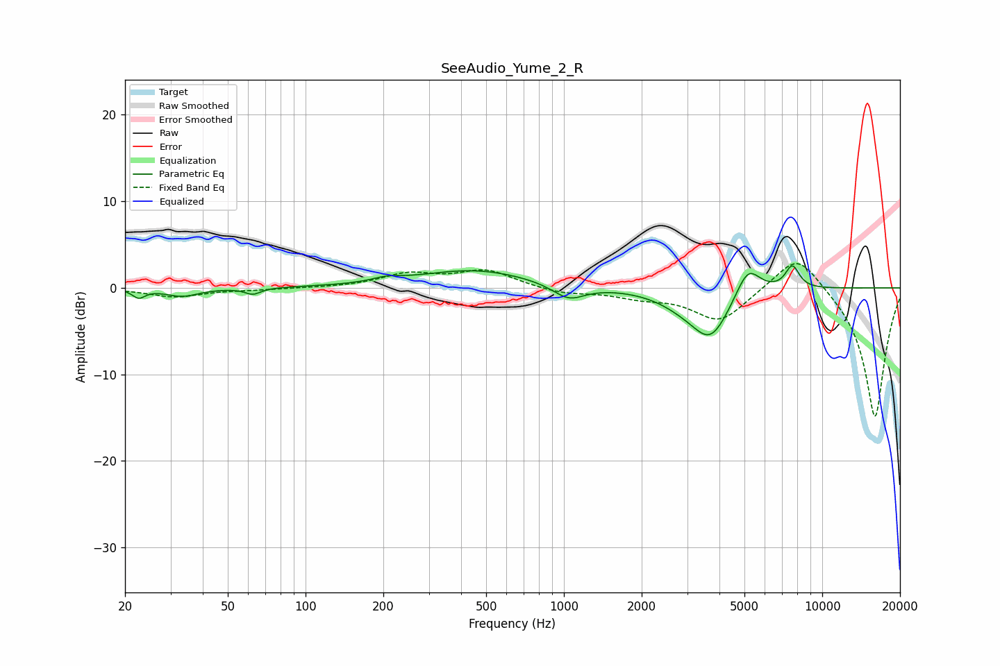

# SeeAudio_Yume_2_R
See [usage instructions](https://github.com/jaakkopasanen/AutoEq#usage) for more options and info.

### Parametric EQs
Apply preamp of -2.6 dB when using parametric equalizer.

|   # | Type    |   Fc (Hz) |    Q |   Gain (dB) |
|-----|---------|-----------|------|-------------|
|   1 | Peaking |        23 | 6    |        -1   |
|   2 | Peaking |        33 | 2.19 |        -0.9 |
|   3 | Peaking |        63 | 4.69 |        -0.7 |
|   4 | Peaking |       206 | 2.57 |         0.5 |
|   5 | Peaking |       450 | 0.65 |         2.1 |
|   6 | Peaking |      1044 | 2.25 |        -1.8 |
|   7 | Peaking |      2874 | 1.43 |        -1.1 |
|   8 | Peaking |      3696 | 1.86 |        -5.4 |
|   9 | Peaking |      5154 | 2.9  |         3.6 |
|  10 | Peaking |      7658 | 4.86 |         2.7 |

### Fixed Band EQs
When using fixed band (also called graphic) equalizer, apply preamp of **-2.9 dB** (if available) and set gains manually with these parameters.

|   # | Type    |   Fc (Hz) |    Q |   Gain (dB) |
|-----|---------|-----------|------|-------------|
|   1 | Peaking |        31 | 1.41 |        -1   |
|   2 | Peaking |        62 | 1.41 |        -0.2 |
|   3 | Peaking |       125 | 1.41 |        -0   |
|   4 | Peaking |       250 | 1.41 |         1.5 |
|   5 | Peaking |       500 | 1.41 |         2   |
|   6 | Peaking |      1000 | 1.41 |        -0.7 |
|   7 | Peaking |      2000 | 1.41 |        -0.9 |
|   8 | Peaking |      4000 | 1.41 |        -3.8 |
|   9 | Peaking |      8000 | 1.41 |         4.5 |
|  10 | Peaking |     16000 | 1.41 |       -15.1 |

### Graphs

