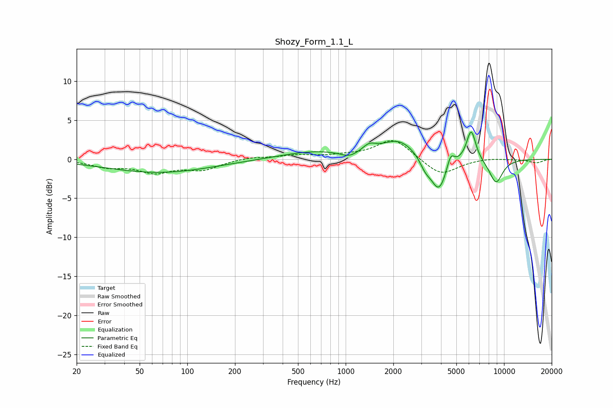

# Shozy_Form_1.1_L
See [usage instructions](https://github.com/jaakkopasanen/AutoEq#usage) for more options and info.

### Parametric EQs
Apply preamp of -3.6 dB when using parametric equalizer.

|   # | Type    |   Fc (Hz) |    Q |   Gain (dB) |
|-----|---------|-----------|------|-------------|
|   1 | Peaking |        66 | 0.42 |        -1.7 |
|   2 | Peaking |       630 | 0.66 |         1   |
|   3 | Peaking |      1051 | 2.57 |        -0.7 |
|   4 | Peaking |      1408 | 3.45 |         0.9 |
|   5 | Peaking |      2172 | 1.27 |         2.4 |
|   6 | Peaking |      3185 | 4.06 |        -1.2 |
|   7 | Peaking |      3877 | 2.76 |        -4.4 |
|   8 | Peaking |      4601 | 6    |         1.8 |
|   9 | Peaking |      6201 | 4.63 |         4   |
|  10 | Peaking |      8896 | 2.99 |        -3.1 |

### Fixed Band EQs
When using fixed band (also called graphic) equalizer, apply preamp of **-2.5 dB** (if available) and set gains manually with these parameters.

|   # | Type    |   Fc (Hz) |    Q |   Gain (dB) |
|-----|---------|-----------|------|-------------|
|   1 | Peaking |        31 | 1.41 |        -0.9 |
|   2 | Peaking |        62 | 1.41 |        -1.5 |
|   3 | Peaking |       125 | 1.41 |        -1.2 |
|   4 | Peaking |       250 | 1.41 |         0.3 |
|   5 | Peaking |       500 | 1.41 |         0.5 |
|   6 | Peaking |      1000 | 1.41 |         0.3 |
|   7 | Peaking |      2000 | 1.41 |         2.7 |
|   8 | Peaking |      4000 | 1.41 |        -2.1 |
|   9 | Peaking |      8000 | 1.41 |         0.2 |
|  10 | Peaking |     16000 | 1.41 |        -0.5 |

### Graphs

