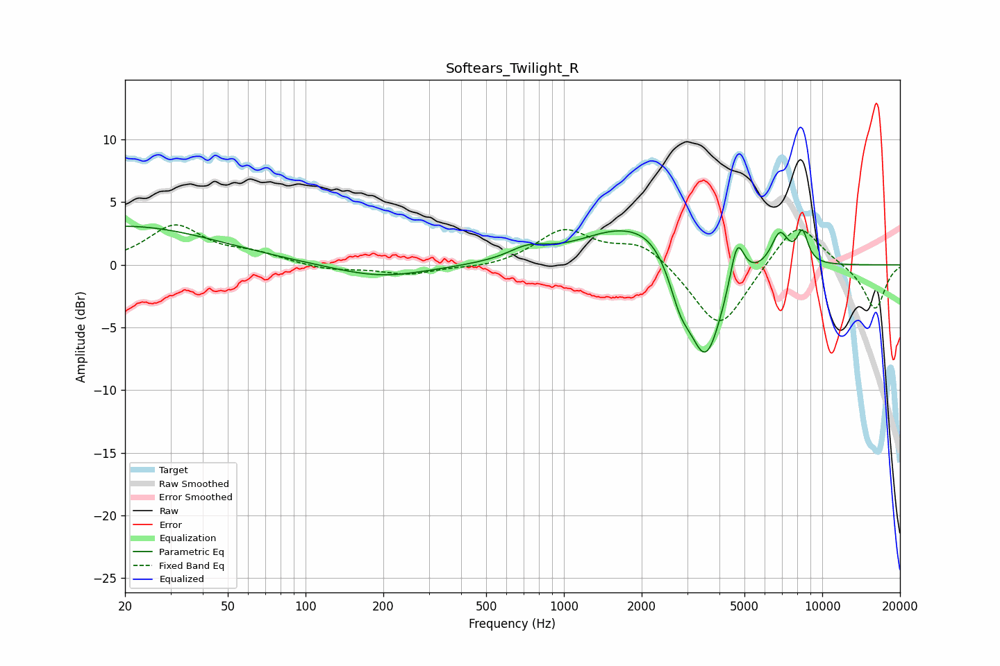

# Softears_Twilight_R
See [usage instructions](https://github.com/jaakkopasanen/AutoEq#usage) for more options and info.

### Parametric EQs
Apply preamp of -3.2 dB when using parametric equalizer.

|   # | Type    |   Fc (Hz) |    Q |   Gain (dB) |
|-----|---------|-----------|------|-------------|
|   1 | Peaking |        20 | 0.4  |         3.1 |
|   2 | Peaking |       195 | 0.78 |        -1.1 |
|   3 | Peaking |       727 | 1.85 |         1   |
|   4 | Peaking |      1624 | 0.87 |         2.6 |
|   5 | Peaking |      2206 | 1.51 |         1.5 |
|   6 | Peaking |      2815 | 3.53 |        -2.3 |
|   7 | Peaking |      3536 | 2.05 |        -8.1 |
|   8 | Peaking |      4681 | 4.99 |         3.8 |
|   9 | Peaking |      6847 | 3.98 |         2.7 |
|  10 | Peaking |      8379 | 5.92 |         2.4 |

### Fixed Band EQs
When using fixed band (also called graphic) equalizer, apply preamp of **-3.3 dB** (if available) and set gains manually with these parameters.

|   # | Type    |   Fc (Hz) |    Q |   Gain (dB) |
|-----|---------|-----------|------|-------------|
|   1 | Peaking |        31 | 1.41 |         3.1 |
|   2 | Peaking |        62 | 1.41 |         0.8 |
|   3 | Peaking |       125 | 1.41 |        -0.4 |
|   4 | Peaking |       250 | 1.41 |        -0.8 |
|   5 | Peaking |       500 | 1.41 |        -0.3 |
|   6 | Peaking |      1000 | 1.41 |         2.7 |
|   7 | Peaking |      2000 | 1.41 |         1.8 |
|   8 | Peaking |      4000 | 1.41 |        -5.4 |
|   9 | Peaking |      8000 | 1.41 |         3.7 |
|  10 | Peaking |     16000 | 1.41 |        -3.6 |

### Graphs

