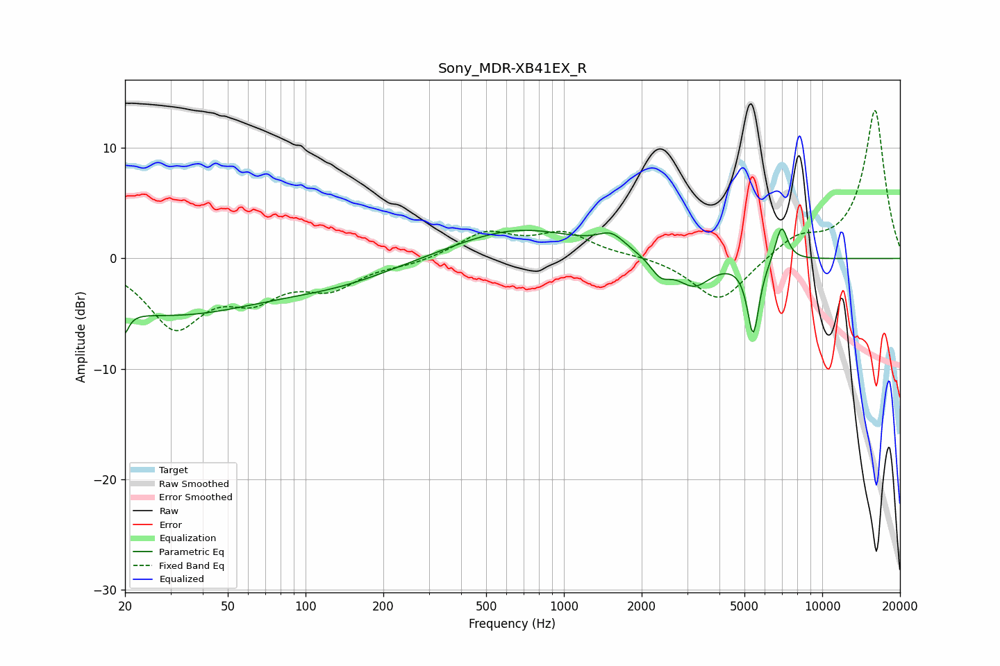

# Sony_MDR-XB41EX_R
See [usage instructions](https://github.com/jaakkopasanen/AutoEq#usage) for more options and info.

### Parametric EQs
Apply preamp of -2.8 dB when using parametric equalizer.

|   # | Type    |   Fc (Hz) |    Q |   Gain (dB) |
|-----|---------|-----------|------|-------------|
|   1 | Peaking |        20 | 5.97 |        -5.4 |
|   2 | Peaking |        20 | 5.9  |         3.2 |
|   3 | Peaking |        29 | 0.37 |        -4.9 |
|   4 | Peaking |       137 | 0.6  |        -1.6 |
|   5 | Peaking |       663 | 0.57 |         2.8 |
|   6 | Peaking |      1528 | 2.7  |         1.4 |
|   7 | Peaking |      2366 | 3.62 |        -1.5 |
|   8 | Peaking |      3182 | 2.12 |        -2.5 |
|   9 | Peaking |      5406 | 6    |        -6.8 |
|  10 | Peaking |      6957 | 5.65 |         3.3 |

### Fixed Band EQs
When using fixed band (also called graphic) equalizer, apply preamp of **-13.5 dB** (if available) and set gains manually with these parameters.

|   # | Type    |   Fc (Hz) |    Q |   Gain (dB) |
|-----|---------|-----------|------|-------------|
|   1 | Peaking |        31 | 1.41 |        -5.9 |
|   2 | Peaking |        62 | 1.41 |        -2.9 |
|   3 | Peaking |       125 | 1.41 |        -2.4 |
|   4 | Peaking |       250 | 1.41 |        -0.5 |
|   5 | Peaking |       500 | 1.41 |         2.3 |
|   6 | Peaking |      1000 | 1.41 |         2.1 |
|   7 | Peaking |      2000 | 1.41 |         0.2 |
|   8 | Peaking |      4000 | 1.41 |        -4.1 |
|   9 | Peaking |      8000 | 1.41 |         1.8 |
|  10 | Peaking |     16000 | 1.41 |        13.5 |

### Graphs

