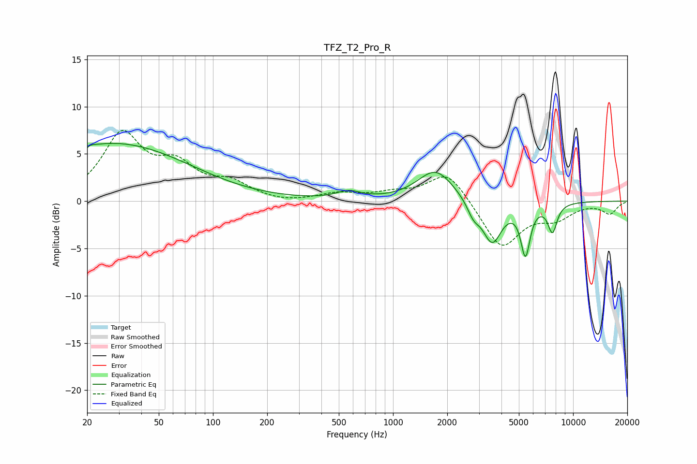

# TFZ_T2_Pro_R
See [usage instructions](https://github.com/jaakkopasanen/AutoEq#usage) for more options and info.

### Parametric EQs
Apply preamp of -6.2 dB when using parametric equalizer.

|   # | Type    |   Fc (Hz) |    Q |   Gain (dB) |
|-----|---------|-----------|------|-------------|
|   1 | Peaking |        20 | 5.73 |        -3.5 |
|   2 | Peaking |        20 | 5.81 |         3.3 |
|   3 | Peaking |        23 | 0.29 |         0.8 |
|   4 | Peaking |        28 | 0.33 |         5.3 |
|   5 | Peaking |       565 | 2.14 |         0.8 |
|   6 | Peaking |      1726 | 1.41 |         3.3 |
|   7 | Peaking |      2797 | 4.02 |        -1.4 |
|   8 | Peaking |      3553 | 2.65 |        -4.4 |
|   9 | Peaking |      5437 | 5.38 |        -5.2 |
|  10 | Peaking |      7681 | 5.25 |        -3   |

### Fixed Band EQs
When using fixed band (also called graphic) equalizer, apply preamp of **-7.6 dB** (if available) and set gains manually with these parameters.

|   # | Type    |   Fc (Hz) |    Q |   Gain (dB) |
|-----|---------|-----------|------|-------------|
|   1 | Peaking |        31 | 1.41 |         6.8 |
|   2 | Peaking |        62 | 1.41 |         3.2 |
|   3 | Peaking |       125 | 1.41 |         1.7 |
|   4 | Peaking |       250 | 1.41 |        -0.3 |
|   5 | Peaking |       500 | 1.41 |         0.7 |
|   6 | Peaking |      1000 | 1.41 |         0.7 |
|   7 | Peaking |      2000 | 1.41 |         3.3 |
|   8 | Peaking |      4000 | 1.41 |        -5   |
|   9 | Peaking |      8000 | 1.41 |        -1.6 |
|  10 | Peaking |     16000 | 1.41 |        -1.3 |

### Graphs

