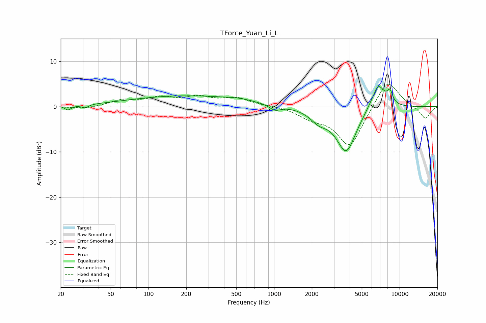

# TForce_Yuan_Li_L
See [usage instructions](https://github.com/jaakkopasanen/AutoEq#usage) for more options and info.

### Parametric EQs
Apply preamp of -4.5 dB when using parametric equalizer.

|   # | Type    |   Fc (Hz) |    Q |   Gain (dB) |
|-----|---------|-----------|------|-------------|
|   1 | Peaking |        23 | 5.88 |        -1   |
|   2 | Peaking |        31 | 5.5  |        -0.7 |
|   3 | Peaking |       200 | 0.3  |         2.4 |
|   4 | Peaking |       531 | 1.45 |         0.4 |
|   5 | Peaking |      1017 | 3.26 |        -1.2 |
|   6 | Peaking |      2273 | 2.07 |        -2.2 |
|   7 | Peaking |      3753 | 1.71 |       -10   |
|   8 | Peaking |      6251 | 6    |        -0.5 |
|   9 | Peaking |      6680 | 2.4  |         6.2 |
|  10 | Peaking |      8373 | 5.97 |         2.5 |

### Fixed Band EQs
When using fixed band (also called graphic) equalizer, apply preamp of **-5.0 dB** (if available) and set gains manually with these parameters.

|   # | Type    |   Fc (Hz) |    Q |   Gain (dB) |
|-----|---------|-----------|------|-------------|
|   1 | Peaking |        31 | 1.41 |        -0.5 |
|   2 | Peaking |        62 | 1.41 |         1.3 |
|   3 | Peaking |       125 | 1.41 |         1.7 |
|   4 | Peaking |       250 | 1.41 |         1.9 |
|   5 | Peaking |       500 | 1.41 |         1.8 |
|   6 | Peaking |      1000 | 1.41 |         0.2 |
|   7 | Peaking |      2000 | 1.41 |        -2   |
|   8 | Peaking |      4000 | 1.41 |        -9   |
|   9 | Peaking |      8000 | 1.41 |         6.5 |
|  10 | Peaking |     16000 | 1.41 |        -2.8 |

### Graphs

