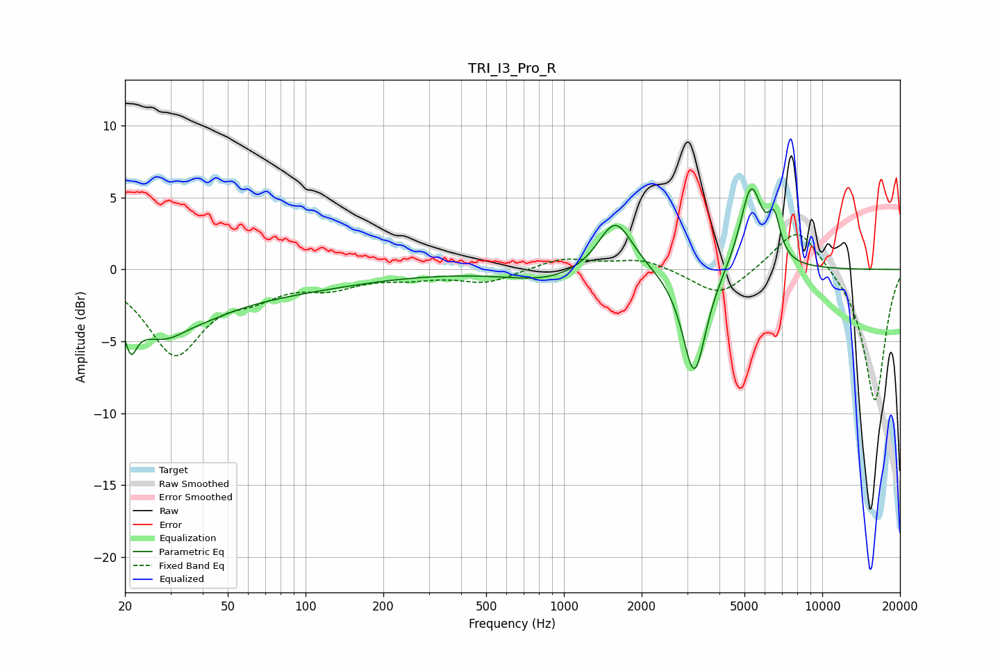

# TRI_I3_Pro_R
See [usage instructions](https://github.com/jaakkopasanen/AutoEq#usage) for more options and info.

### Parametric EQs
Apply preamp of -5.7 dB when using parametric equalizer.

|   # | Type    |   Fc (Hz) |    Q |   Gain (dB) |
|-----|---------|-----------|------|-------------|
|   1 | Peaking |        21 | 5.9  |         2.9 |
|   2 | Peaking |        21 | 5.96 |        -5.3 |
|   3 | Peaking |        29 | 0.94 |        -4.3 |
|   4 | Peaking |        35 | 1.78 |         0.7 |
|   5 | Peaking |        69 | 0.39 |        -1.3 |
|   6 | Peaking |       869 | 0.89 |        -0.8 |
|   7 | Peaking |      1583 | 2.11 |         3.7 |
|   8 | Peaking |      3197 | 3.07 |        -7.6 |
|   9 | Peaking |      5301 | 3.22 |         5.9 |
|  10 | Peaking |      6523 | 5.99 |         2.6 |

### Fixed Band EQs
When using fixed band (also called graphic) equalizer, apply preamp of **-2.5 dB** (if available) and set gains manually with these parameters.

|   # | Type    |   Fc (Hz) |    Q |   Gain (dB) |
|-----|---------|-----------|------|-------------|
|   1 | Peaking |        31 | 1.41 |        -5.7 |
|   2 | Peaking |        62 | 1.41 |        -1.3 |
|   3 | Peaking |       125 | 1.41 |        -1   |
|   4 | Peaking |       250 | 1.41 |        -0.5 |
|   5 | Peaking |       500 | 1.41 |        -0.9 |
|   6 | Peaking |      1000 | 1.41 |         0.8 |
|   7 | Peaking |      2000 | 1.41 |         0.8 |
|   8 | Peaking |      4000 | 1.41 |        -2   |
|   9 | Peaking |      8000 | 1.41 |         3.2 |
|  10 | Peaking |     16000 | 1.41 |        -9.3 |

### Graphs

