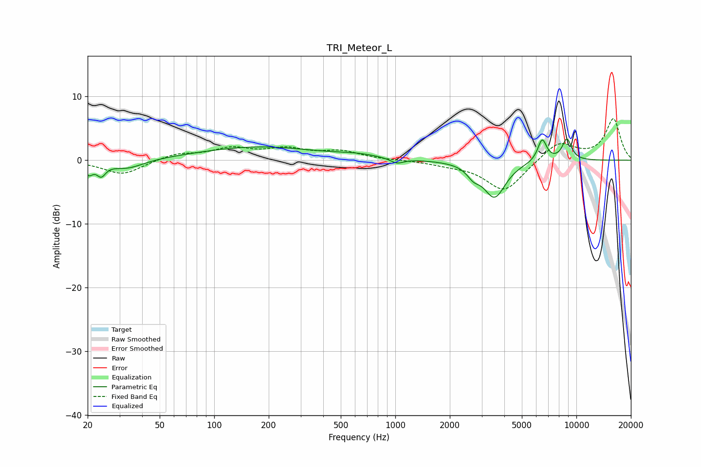

# TRI_Meteor_L
See [usage instructions](https://github.com/jaakkopasanen/AutoEq#usage) for more options and info.

### Parametric EQs
Apply preamp of -3.4 dB when using parametric equalizer.

|   # | Type    |   Fc (Hz) |    Q |   Gain (dB) |
|-----|---------|-----------|------|-------------|
|   1 | Peaking |        20 | 5.99 |        -1.8 |
|   2 | Peaking |        24 | 5.88 |        -1.8 |
|   3 | Peaking |        33 | 1.55 |        -1.4 |
|   4 | Peaking |       175 | 0.43 |         2.1 |
|   5 | Peaking |       622 | 1.22 |         0.5 |
|   6 | Peaking |      1021 | 3.92 |        -0.8 |
|   7 | Peaking |      2696 | 4.11 |        -1.4 |
|   8 | Peaking |      3532 | 2.3  |        -5.7 |
|   9 | Peaking |      6473 | 5.45 |         3.5 |
|  10 | Peaking |      8866 | 4.88 |         3.4 |

### Fixed Band EQs
When using fixed band (also called graphic) equalizer, apply preamp of **-6.6 dB** (if available) and set gains manually with these parameters.

|   # | Type    |   Fc (Hz) |    Q |   Gain (dB) |
|-----|---------|-----------|------|-------------|
|   1 | Peaking |        31 | 1.41 |        -2.3 |
|   2 | Peaking |        62 | 1.41 |         1   |
|   3 | Peaking |       125 | 1.41 |         1.7 |
|   4 | Peaking |       250 | 1.41 |         1.6 |
|   5 | Peaking |       500 | 1.41 |         1.3 |
|   6 | Peaking |      1000 | 1.41 |         0   |
|   7 | Peaking |      2000 | 1.41 |        -0.5 |
|   8 | Peaking |      4000 | 1.41 |        -4.9 |
|   9 | Peaking |      8000 | 1.41 |         2.9 |
|  10 | Peaking |     16000 | 1.41 |         6.4 |

### Graphs

