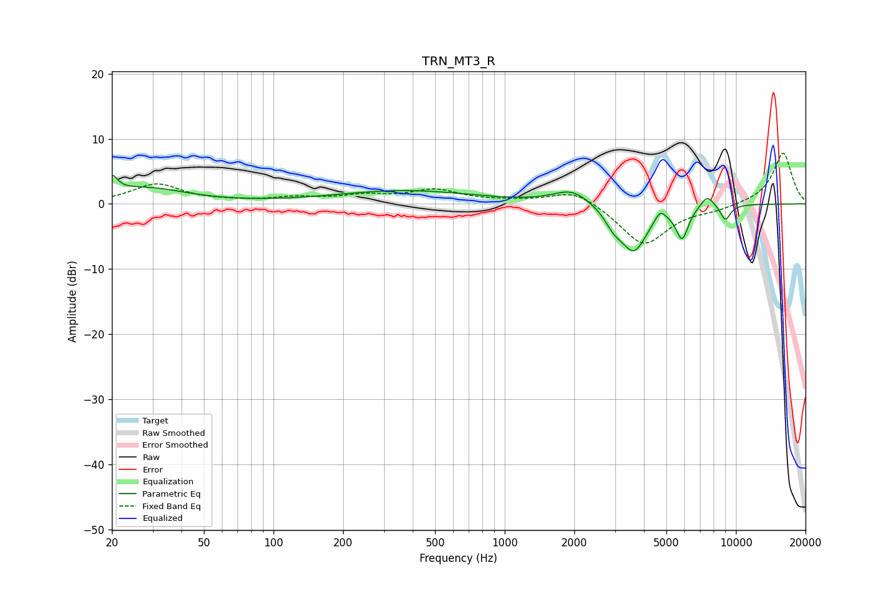

# TRN_MT3_R
See [usage instructions](https://github.com/jaakkopasanen/AutoEq#usage) for more options and info.

### Parametric EQs
Apply preamp of -4.5 dB when using parametric equalizer.

|   # | Type    |   Fc (Hz) |    Q |   Gain (dB) |
|-----|---------|-----------|------|-------------|
|   1 | Peaking |        20 | 5.9  |         2.5 |
|   2 | Peaking |        27 | 0.79 |         2.4 |
|   3 | Peaking |       370 | 0.47 |         2   |
|   4 | Peaking |      1955 | 1.75 |         2.3 |
|   5 | Peaking |      2959 | 3.67 |        -1.9 |
|   6 | Peaking |      3621 | 2.39 |        -7   |
|   7 | Peaking |      4699 | 6    |         1.6 |
|   8 | Peaking |      5855 | 5.18 |        -4.8 |
|   9 | Peaking |      7513 | 4.51 |         1.9 |
|  10 | Peaking |      9006 | 5.74 |        -2.4 |

### Fixed Band EQs
When using fixed band (also called graphic) equalizer, apply preamp of **-7.9 dB** (if available) and set gains manually with these parameters.

|   # | Type    |   Fc (Hz) |    Q |   Gain (dB) |
|-----|---------|-----------|------|-------------|
|   1 | Peaking |        31 | 1.41 |         3   |
|   2 | Peaking |        62 | 1.41 |         0.2 |
|   3 | Peaking |       125 | 1.41 |         0.8 |
|   4 | Peaking |       250 | 1.41 |         1.1 |
|   5 | Peaking |       500 | 1.41 |         2   |
|   6 | Peaking |      1000 | 1.41 |         0.3 |
|   7 | Peaking |      2000 | 1.41 |         2.3 |
|   8 | Peaking |      4000 | 1.41 |        -6.4 |
|   9 | Peaking |      8000 | 1.41 |        -0.8 |
|  10 | Peaking |     16000 | 1.41 |         7.9 |

### Graphs

