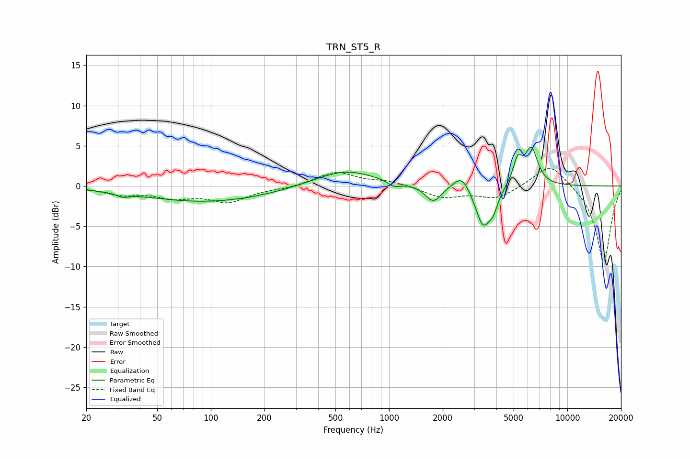

# TRN_ST5_R
See [usage instructions](https://github.com/jaakkopasanen/AutoEq#usage) for more options and info.

### Parametric EQs
Apply preamp of -4.9 dB when using parametric equalizer.

|   # | Type    |   Fc (Hz) |    Q |   Gain (dB) |
|-----|---------|-----------|------|-------------|
|   1 | Peaking |        32 | 4.18 |        -0.5 |
|   2 | Peaking |        96 | 0.39 |        -2   |
|   3 | Peaking |       564 | 0.82 |         2.1 |
|   4 | Peaking |      1069 | 4.02 |        -0.7 |
|   5 | Peaking |      1769 | 3.17 |        -2.1 |
|   6 | Peaking |      2555 | 3.17 |         1.9 |
|   7 | Peaking |      3376 | 3.21 |        -5.1 |
|   8 | Peaking |      3856 | 5.86 |        -1.5 |
|   9 | Peaking |      5264 | 5.26 |         3   |
|  10 | Peaking |      6284 | 3.88 |         4.5 |

### Fixed Band EQs
When using fixed band (also called graphic) equalizer, apply preamp of **-2.3 dB** (if available) and set gains manually with these parameters.

|   # | Type    |   Fc (Hz) |    Q |   Gain (dB) |
|-----|---------|-----------|------|-------------|
|   1 | Peaking |        31 | 1.41 |        -0.9 |
|   2 | Peaking |        62 | 1.41 |        -1.2 |
|   3 | Peaking |       125 | 1.41 |        -1.8 |
|   4 | Peaking |       250 | 1.41 |        -0.3 |
|   5 | Peaking |       500 | 1.41 |         1.8 |
|   6 | Peaking |      1000 | 1.41 |         0.6 |
|   7 | Peaking |      2000 | 1.41 |        -1.4 |
|   8 | Peaking |      4000 | 1.41 |        -1.5 |
|   9 | Peaking |      8000 | 1.41 |         3   |
|  10 | Peaking |     16000 | 1.41 |        -9.5 |

### Graphs

