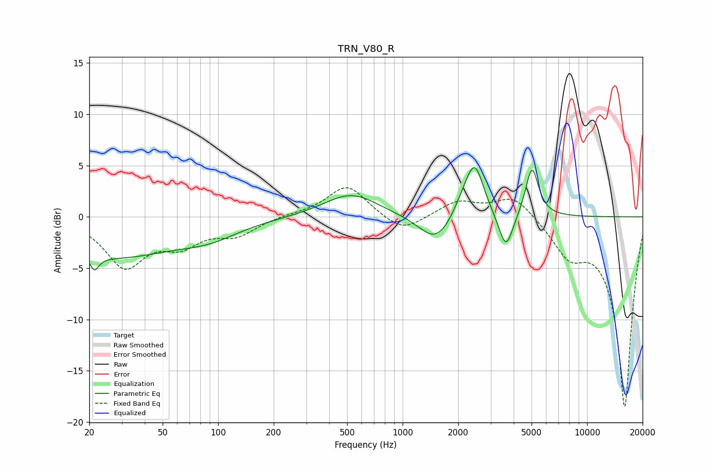

# TRN_V80_R
See [usage instructions](https://github.com/jaakkopasanen/AutoEq#usage) for more options and info.

### Parametric EQs
Apply preamp of -4.9 dB when using parametric equalizer.

|   # | Type    |   Fc (Hz) |    Q |   Gain (dB) |
|-----|---------|-----------|------|-------------|
|   1 | Peaking |        21 | 6    |         3.1 |
|   2 | Peaking |        21 | 5.88 |        -4.4 |
|   3 | Peaking |        26 | 0.39 |        -3.8 |
|   4 | Peaking |        90 | 0.89 |        -1.2 |
|   5 | Peaking |       525 | 0.97 |         2.3 |
|   6 | Peaking |      1527 | 1.53 |        -2.8 |
|   7 | Peaking |      2170 | 2.25 |         1.8 |
|   8 | Peaking |      2472 | 2.98 |         4.5 |
|   9 | Peaking |      3633 | 3.64 |        -3.7 |
|  10 | Peaking |      5026 | 4.02 |         4.9 |

### Fixed Band EQs
When using fixed band (also called graphic) equalizer, apply preamp of **-2.9 dB** (if available) and set gains manually with these parameters.

|   # | Type    |   Fc (Hz) |    Q |   Gain (dB) |
|-----|---------|-----------|------|-------------|
|   1 | Peaking |        31 | 1.41 |        -4.6 |
|   2 | Peaking |        62 | 1.41 |        -2.3 |
|   3 | Peaking |       125 | 1.41 |        -1.6 |
|   4 | Peaking |       250 | 1.41 |         0.2 |
|   5 | Peaking |       500 | 1.41 |         3.1 |
|   6 | Peaking |      1000 | 1.41 |        -1.7 |
|   7 | Peaking |      2000 | 1.41 |         1.5 |
|   8 | Peaking |      4000 | 1.41 |         2.2 |
|   9 | Peaking |      8000 | 1.41 |        -3.1 |
|  10 | Peaking |     16000 | 1.41 |       -18.5 |

### Graphs

