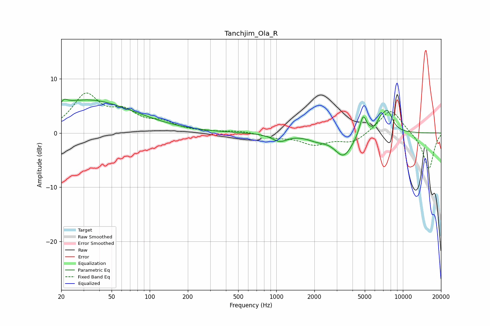

# Tanchjim_Ola_R
See [usage instructions](https://github.com/jaakkopasanen/AutoEq#usage) for more options and info.

### Parametric EQs
Apply preamp of -6.3 dB when using parametric equalizer.

|   # | Type    |   Fc (Hz) |    Q |   Gain (dB) |
|-----|---------|-----------|------|-------------|
|   1 | Peaking |        20 | 5.8  |        -3.1 |
|   2 | Peaking |        20 | 5.14 |         3.7 |
|   3 | Peaking |        33 | 0.61 |         1.3 |
|   4 | Peaking |        33 | 0.34 |         4.7 |
|   5 | Peaking |      1064 | 2.34 |        -1.4 |
|   6 | Peaking |      2101 | 1.81 |        -0.9 |
|   7 | Peaking |      3398 | 1.97 |        -4.2 |
|   8 | Peaking |      4851 | 4.97 |         3.9 |
|   9 | Peaking |      6645 | 5.32 |         1.2 |
|  10 | Peaking |      7529 | 3.2  |         3.9 |

### Fixed Band EQs
When using fixed band (also called graphic) equalizer, apply preamp of **-7.5 dB** (if available) and set gains manually with these parameters.

|   # | Type    |   Fc (Hz) |    Q |   Gain (dB) |
|-----|---------|-----------|------|-------------|
|   1 | Peaking |        31 | 1.41 |         6.7 |
|   2 | Peaking |        62 | 1.41 |         3.2 |
|   3 | Peaking |       125 | 1.41 |         1.6 |
|   4 | Peaking |       250 | 1.41 |         0.1 |
|   5 | Peaking |       500 | 1.41 |         0.4 |
|   6 | Peaking |      1000 | 1.41 |        -0.7 |
|   7 | Peaking |      2000 | 1.41 |        -2   |
|   8 | Peaking |      4000 | 1.41 |        -1.8 |
|   9 | Peaking |      8000 | 1.41 |         4.6 |
|  10 | Peaking |     16000 | 1.41 |        -6.8 |

### Graphs

