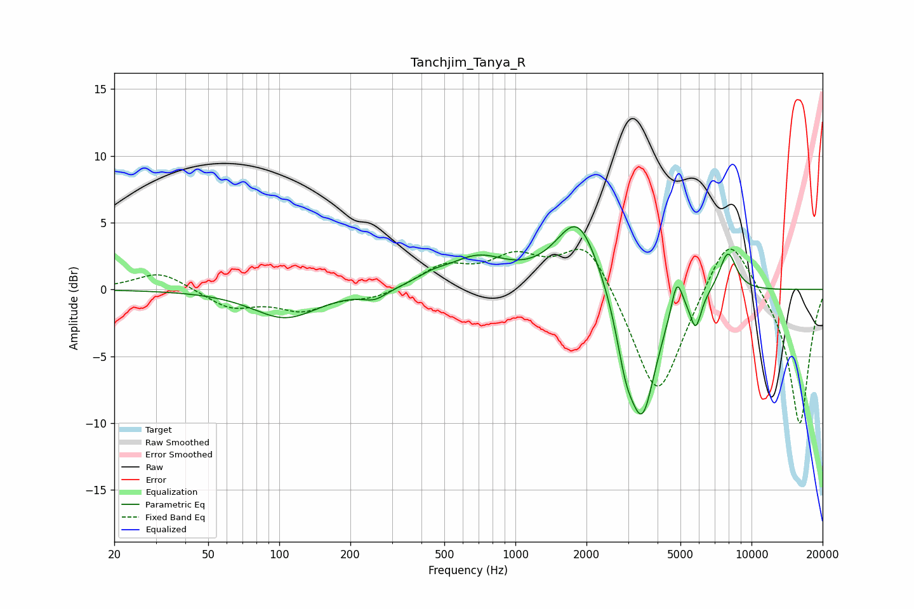

# Tanchjim_Tanya_R
See [usage instructions](https://github.com/jaakkopasanen/AutoEq#usage) for more options and info.

### Parametric EQs
Apply preamp of -4.8 dB when using parametric equalizer.

|   # | Type    |   Fc (Hz) |    Q |   Gain (dB) |
|-----|---------|-----------|------|-------------|
|   1 | Peaking |       106 | 1.03 |        -2.1 |
|   2 | Peaking |       254 | 2.75 |        -0.7 |
|   3 | Peaking |       443 | 2.2  |         0.5 |
|   4 | Peaking |       691 | 1.11 |         2.2 |
|   5 | Peaking |      1842 | 1.5  |         5.5 |
|   6 | Peaking |      2924 | 3.6  |        -3.2 |
|   7 | Peaking |      3448 | 2.31 |        -9.3 |
|   8 | Peaking |      4829 | 5.94 |         2.7 |
|   9 | Peaking |      5805 | 6    |        -2.4 |
|  10 | Peaking |      7940 | 3.61 |         3   |

### Fixed Band EQs
When using fixed band (also called graphic) equalizer, apply preamp of **-3.1 dB** (if available) and set gains manually with these parameters.

|   # | Type    |   Fc (Hz) |    Q |   Gain (dB) |
|-----|---------|-----------|------|-------------|
|   1 | Peaking |        31 | 1.41 |         1.4 |
|   2 | Peaking |        62 | 1.41 |        -1.4 |
|   3 | Peaking |       125 | 1.41 |        -1.4 |
|   4 | Peaking |       250 | 1.41 |        -0.7 |
|   5 | Peaking |       500 | 1.41 |         1.6 |
|   6 | Peaking |      1000 | 1.41 |         2.2 |
|   7 | Peaking |      2000 | 1.41 |         3.9 |
|   8 | Peaking |      4000 | 1.41 |        -8.6 |
|   9 | Peaking |      8000 | 1.41 |         4.8 |
|  10 | Peaking |     16000 | 1.41 |       -10.2 |

### Graphs

