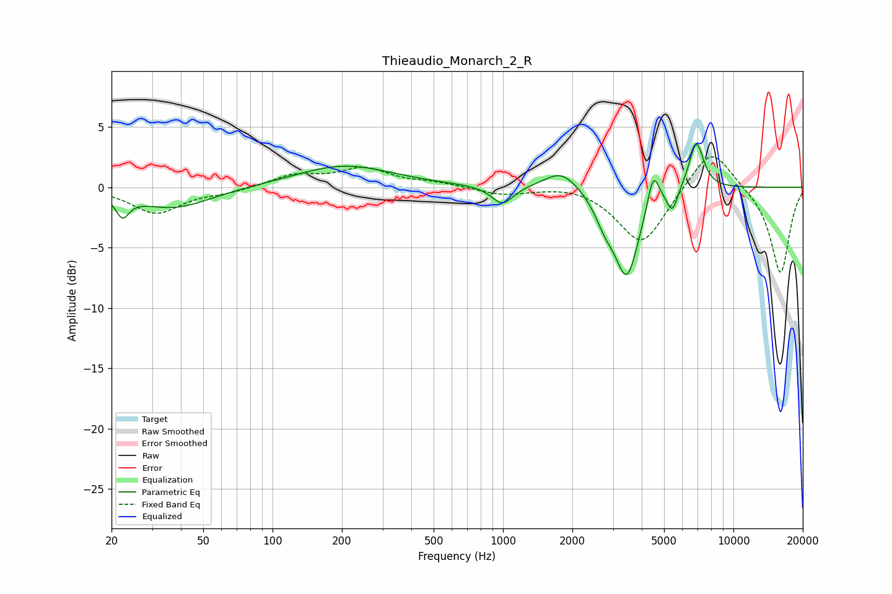

# Thieaudio_Monarch_2_R
See [usage instructions](https://github.com/jaakkopasanen/AutoEq#usage) for more options and info.

### Parametric EQs
Apply preamp of -3.7 dB when using parametric equalizer.

|   # | Type    |   Fc (Hz) |    Q |   Gain (dB) |
|-----|---------|-----------|------|-------------|
|   1 | Peaking |        22 | 5.03 |        -1.7 |
|   2 | Peaking |        37 | 0.89 |        -1.7 |
|   3 | Peaking |       205 | 0.68 |         1.8 |
|   4 | Peaking |       994 | 3.05 |        -1.6 |
|   5 | Peaking |      1795 | 1.91 |         1.6 |
|   6 | Peaking |      2764 | 3.32 |        -1.7 |
|   7 | Peaking |      3448 | 2.6  |        -7.2 |
|   8 | Peaking |      4489 | 5.54 |         2.9 |
|   9 | Peaking |      5429 | 6    |        -1.9 |
|  10 | Peaking |      6899 | 4.22 |         4   |

### Fixed Band EQs
When using fixed band (also called graphic) equalizer, apply preamp of **-2.6 dB** (if available) and set gains manually with these parameters.

|   # | Type    |   Fc (Hz) |    Q |   Gain (dB) |
|-----|---------|-----------|------|-------------|
|   1 | Peaking |        31 | 1.41 |        -2.1 |
|   2 | Peaking |        62 | 1.41 |        -0.4 |
|   3 | Peaking |       125 | 1.41 |         1   |
|   4 | Peaking |       250 | 1.41 |         1.5 |
|   5 | Peaking |       500 | 1.41 |         0.3 |
|   6 | Peaking |      1000 | 1.41 |        -0.6 |
|   7 | Peaking |      2000 | 1.41 |         0.3 |
|   8 | Peaking |      4000 | 1.41 |        -4.8 |
|   9 | Peaking |      8000 | 1.41 |         3.6 |
|  10 | Peaking |     16000 | 1.41 |        -7.2 |

### Graphs

