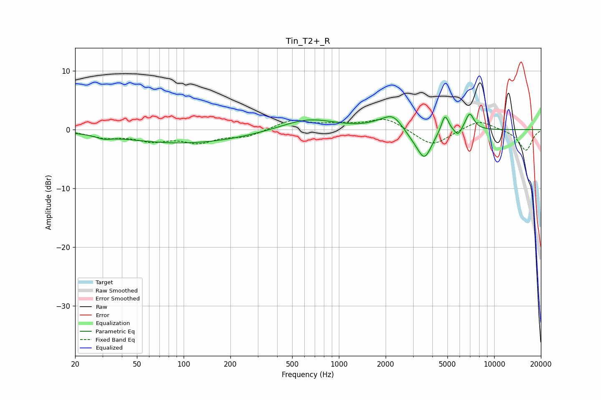

# Tin_T2+_R
See [usage instructions](https://github.com/jaakkopasanen/AutoEq#usage) for more options and info.

### Parametric EQs
Apply preamp of -2.7 dB when using parametric equalizer.

|   # | Type    |   Fc (Hz) |    Q |   Gain (dB) |
|-----|---------|-----------|------|-------------|
|   1 | Peaking |        31 | 3.12 |        -0.5 |
|   2 | Peaking |       101 | 0.35 |        -2.3 |
|   3 | Peaking |       633 | 0.82 |         2   |
|   4 | Peaking |      1773 | 2    |         0.5 |
|   5 | Peaking |      2227 | 2.22 |         2.5 |
|   6 | Peaking |      3055 | 2.1  |        -1.2 |
|   7 | Peaking |      3566 | 3.05 |        -4.4 |
|   8 | Peaking |      4819 | 5.95 |         3.1 |
|   9 | Peaking |      5848 | 6    |        -1.3 |
|  10 | Peaking |      6953 | 4.81 |         2.9 |

### Fixed Band EQs
When using fixed band (also called graphic) equalizer, apply preamp of **-1.8 dB** (if available) and set gains manually with these parameters.

|   # | Type    |   Fc (Hz) |    Q |   Gain (dB) |
|-----|---------|-----------|------|-------------|
|   1 | Peaking |        31 | 1.41 |        -1.2 |
|   2 | Peaking |        62 | 1.41 |        -1.6 |
|   3 | Peaking |       125 | 1.41 |        -1.9 |
|   4 | Peaking |       250 | 1.41 |        -1.1 |
|   5 | Peaking |       500 | 1.41 |         1.6 |
|   6 | Peaking |      1000 | 1.41 |         0.8 |
|   7 | Peaking |      2000 | 1.41 |         2   |
|   8 | Peaking |      4000 | 1.41 |        -2.9 |
|   9 | Peaking |      8000 | 1.41 |         1.7 |
|  10 | Peaking |     16000 | 1.41 |        -3.6 |

### Graphs

