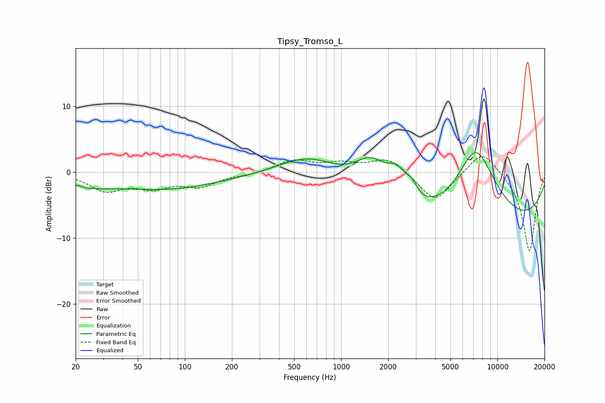

# Tipsy_Tromso_L
See [usage instructions](https://github.com/jaakkopasanen/AutoEq#usage) for more options and info.

### Parametric EQs
Apply preamp of -3.0 dB when using parametric equalizer.

|   # | Type    |   Fc (Hz) |    Q |   Gain (dB) |
|-----|---------|-----------|------|-------------|
|   1 | Peaking |        20 | 3.42 |         0.9 |
|   2 | Peaking |        27 | 0.18 |        -4.3 |
|   3 | Peaking |        33 | 0.5  |         1.6 |
|   4 | Peaking |       454 | 1.19 |         0.3 |
|   5 | Peaking |       658 | 0.76 |         3.7 |
|   6 | Peaking |      1568 | 1.1  |         6.8 |
|   7 | Peaking |      2284 | 2.3  |         3.7 |
|   8 | Peaking |      2824 | 3.95 |         1.9 |
|   9 | Peaking |      6382 | 0.18 |       -13.3 |
|  10 | Peaking |      7266 | 0.79 |        15.8 |

### Fixed Band EQs
When using fixed band (also called graphic) equalizer, apply preamp of **-2.4 dB** (if available) and set gains manually with these parameters.

|   # | Type    |   Fc (Hz) |    Q |   Gain (dB) |
|-----|---------|-----------|------|-------------|
|   1 | Peaking |        31 | 1.41 |        -2.7 |
|   2 | Peaking |        62 | 1.41 |        -2   |
|   3 | Peaking |       125 | 1.41 |        -2   |
|   4 | Peaking |       250 | 1.41 |        -0.4 |
|   5 | Peaking |       500 | 1.41 |         1.7 |
|   6 | Peaking |      1000 | 1.41 |         1.1 |
|   7 | Peaking |      2000 | 1.41 |         2.2 |
|   8 | Peaking |      4000 | 1.41 |        -4.7 |
|   9 | Peaking |      8000 | 1.41 |         3.7 |
|  10 | Peaking |     16000 | 1.41 |       -12.2 |

### Graphs

