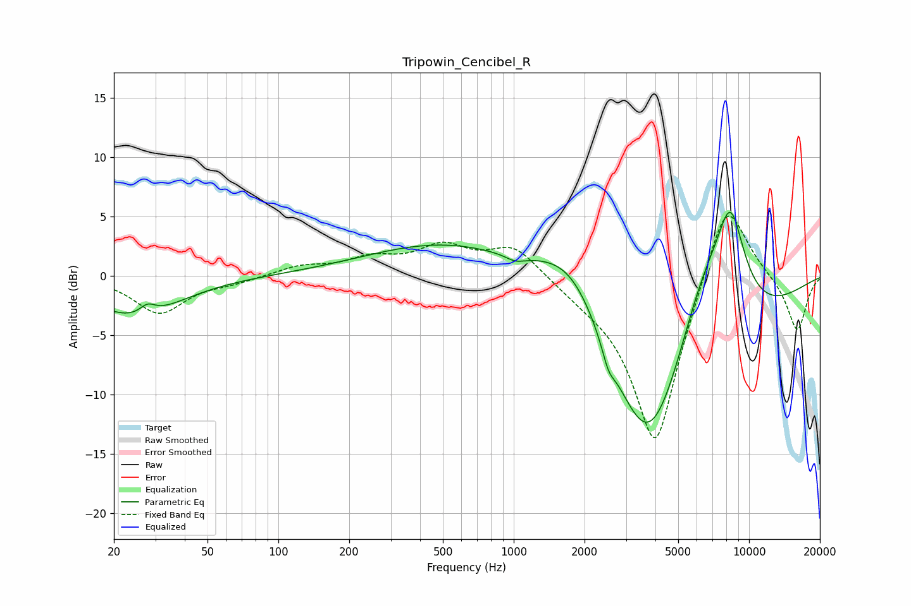

# Tripowin_Cencibel_R
See [usage instructions](https://github.com/jaakkopasanen/AutoEq#usage) for more options and info.

### Parametric EQs
Apply preamp of -5.4 dB when using parametric equalizer.

|   # | Type    |   Fc (Hz) |    Q |   Gain (dB) |
|-----|---------|-----------|------|-------------|
|   1 | Peaking |        25 | 0.76 |        -3.4 |
|   2 | Peaking |        28 | 4.2  |         0.9 |
|   3 | Peaking |       743 | 0.34 |         4.1 |
|   4 | Peaking |      1017 | 3.34 |        -0.5 |
|   5 | Peaking |      1803 | 0.83 |         6.9 |
|   6 | Peaking |      2521 | 5.92 |        -0.9 |
|   7 | Peaking |      2546 | 4.13 |        -0.4 |
|   8 | Peaking |      3755 | 0.52 |       -20   |
|   9 | Peaking |      6303 | 0.99 |         8.8 |
|  10 | Peaking |      8331 | 2.03 |         8.3 |

### Fixed Band EQs
When using fixed band (also called graphic) equalizer, apply preamp of **-5.1 dB** (if available) and set gains manually with these parameters.

|   # | Type    |   Fc (Hz) |    Q |   Gain (dB) |
|-----|---------|-----------|------|-------------|
|   1 | Peaking |        31 | 1.41 |        -3.1 |
|   2 | Peaking |        62 | 1.41 |        -0.5 |
|   3 | Peaking |       125 | 1.41 |         0.8 |
|   4 | Peaking |       250 | 1.41 |         1.3 |
|   5 | Peaking |       500 | 1.41 |         2.3 |
|   6 | Peaking |      1000 | 1.41 |         2.6 |
|   7 | Peaking |      2000 | 1.41 |        -0.8 |
|   8 | Peaking |      4000 | 1.41 |       -14.8 |
|   9 | Peaking |      8000 | 1.41 |         7.9 |
|  10 | Peaking |     16000 | 1.41 |        -4.7 |

### Graphs

