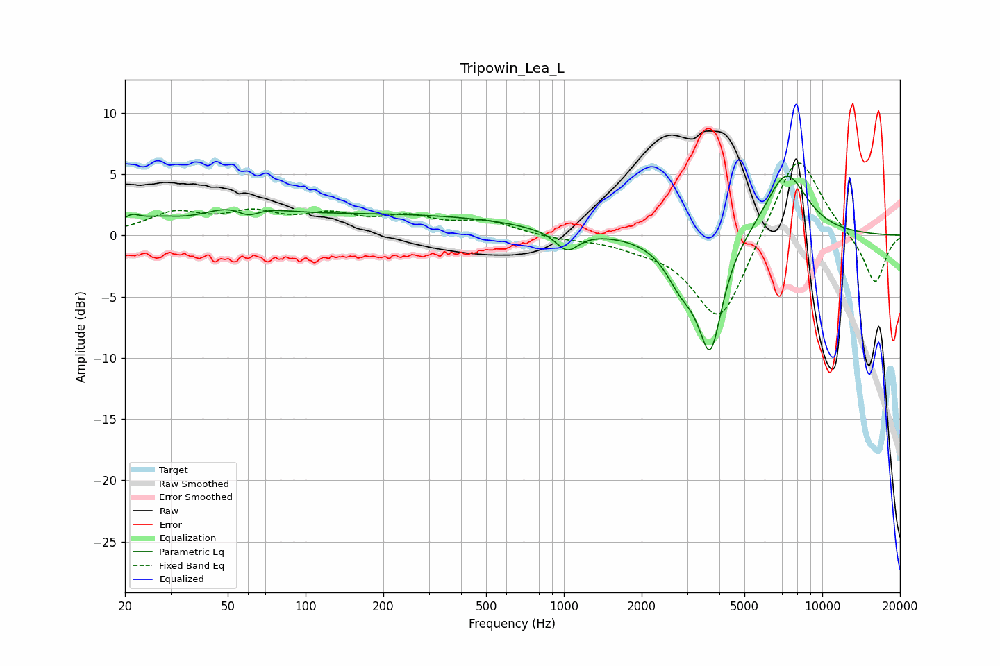

# Tripowin_Lea_L
See [usage instructions](https://github.com/jaakkopasanen/AutoEq#usage) for more options and info.

### Parametric EQs
Apply preamp of -4.9 dB when using parametric equalizer.

|   # | Type    |   Fc (Hz) |    Q |   Gain (dB) |
|-----|---------|-----------|------|-------------|
|   1 | Peaking |        21 | 3.96 |         0.9 |
|   2 | Peaking |        27 | 1.85 |         0.7 |
|   3 | Peaking |        56 | 1.19 |         1.8 |
|   4 | Peaking |        60 | 2.87 |        -1.1 |
|   5 | Peaking |       208 | 0.25 |         1.7 |
|   6 | Peaking |       778 | 1.65 |        -0.1 |
|   7 | Peaking |      1029 | 3.15 |        -1.7 |
|   8 | Peaking |      2850 | 2.24 |        -3   |
|   9 | Peaking |      3688 | 2.94 |        -8.9 |
|  10 | Peaking |      7250 | 1.64 |         5.3 |

### Fixed Band EQs
When using fixed band (also called graphic) equalizer, apply preamp of **-6.0 dB** (if available) and set gains manually with these parameters.

|   # | Type    |   Fc (Hz) |    Q |   Gain (dB) |
|-----|---------|-----------|------|-------------|
|   1 | Peaking |        31 | 1.41 |         1.7 |
|   2 | Peaking |        62 | 1.41 |         1.5 |
|   3 | Peaking |       125 | 1.41 |         1.4 |
|   4 | Peaking |       250 | 1.41 |         1.3 |
|   5 | Peaking |       500 | 1.41 |         1.1 |
|   6 | Peaking |      1000 | 1.41 |        -0.3 |
|   7 | Peaking |      2000 | 1.41 |        -0.6 |
|   8 | Peaking |      4000 | 1.41 |        -7.4 |
|   9 | Peaking |      8000 | 1.41 |         7.2 |
|  10 | Peaking |     16000 | 1.41 |        -4.1 |

### Graphs

