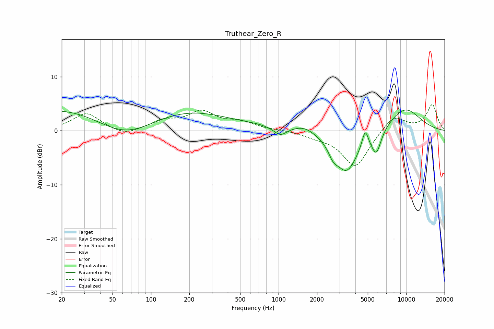

# Truthear_Zero_R
See [usage instructions](https://github.com/jaakkopasanen/AutoEq#usage) for more options and info.

### Parametric EQs
Apply preamp of -3.9 dB when using parametric equalizer.

|   # | Type    |   Fc (Hz) |    Q |   Gain (dB) |
|-----|---------|-----------|------|-------------|
|   1 | Peaking |        61 | 0.2  |         8.8 |
|   2 | Peaking |        63 | 0.48 |        -8.6 |
|   3 | Peaking |       684 | 1.58 |         0.2 |
|   4 | Peaking |      1032 | 2.88 |        -1.5 |
|   5 | Peaking |      1588 | 1.52 |         1.3 |
|   6 | Peaking |      2681 | 3.92 |        -1.7 |
|   7 | Peaking |      3408 | 1.51 |        -7.6 |
|   8 | Peaking |      4770 | 5.87 |         3.2 |
|   9 | Peaking |      5832 | 3.59 |        -4.2 |
|  10 | Peaking |      9710 | 0.93 |         4.3 |

### Fixed Band EQs
When using fixed band (also called graphic) equalizer, apply preamp of **-4.9 dB** (if available) and set gains manually with these parameters.

|   # | Type    |   Fc (Hz) |    Q |   Gain (dB) |
|-----|---------|-----------|------|-------------|
|   1 | Peaking |        31 | 1.41 |         3.2 |
|   2 | Peaking |        62 | 1.41 |        -1.1 |
|   3 | Peaking |       125 | 1.41 |         1.7 |
|   4 | Peaking |       250 | 1.41 |         3.3 |
|   5 | Peaking |       500 | 1.41 |         1.4 |
|   6 | Peaking |      1000 | 1.41 |         0.1 |
|   7 | Peaking |      2000 | 1.41 |        -0.8 |
|   8 | Peaking |      4000 | 1.41 |        -6.8 |
|   9 | Peaking |      8000 | 1.41 |         3   |
|  10 | Peaking |     16000 | 1.41 |         4.8 |

### Graphs

