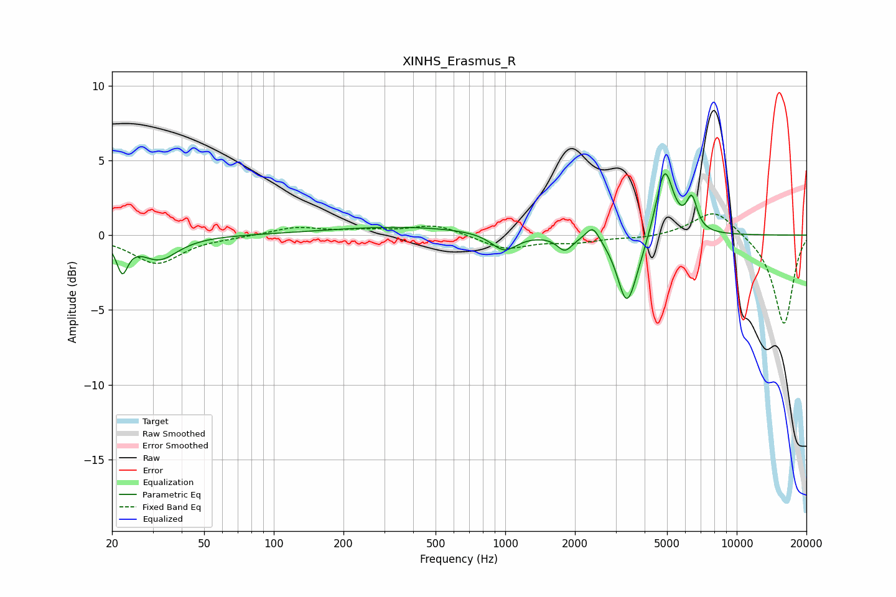

# XINHS_Erasmus_R
See [usage instructions](https://github.com/jaakkopasanen/AutoEq#usage) for more options and info.

### Parametric EQs
Apply preamp of -4.2 dB when using parametric equalizer.

|   # | Type    |   Fc (Hz) |    Q |   Gain (dB) |
|-----|---------|-----------|------|-------------|
|   1 | Peaking |        22 | 5.97 |        -2   |
|   2 | Peaking |        32 | 1.78 |        -1.6 |
|   3 | Peaking |       359 | 0.43 |         0.6 |
|   4 | Peaking |       989 | 2.56 |        -1.2 |
|   5 | Peaking |      1809 | 4.36 |        -1   |
|   6 | Peaking |      2389 | 4.91 |         1   |
|   7 | Peaking |      3339 | 3.53 |        -4.1 |
|   8 | Peaking |      3693 | 2.8  |        -1   |
|   9 | Peaking |      4880 | 3.73 |         4.6 |
|  10 | Peaking |      6398 | 6    |         2.1 |

### Fixed Band EQs
When using fixed band (also called graphic) equalizer, apply preamp of **-1.5 dB** (if available) and set gains manually with these parameters.

|   # | Type    |   Fc (Hz) |    Q |   Gain (dB) |
|-----|---------|-----------|------|-------------|
|   1 | Peaking |        31 | 1.41 |        -1.9 |
|   2 | Peaking |        62 | 1.41 |        -0.1 |
|   3 | Peaking |       125 | 1.41 |         0.5 |
|   4 | Peaking |       250 | 1.41 |         0.3 |
|   5 | Peaking |       500 | 1.41 |         0.7 |
|   6 | Peaking |      1000 | 1.41 |        -0.9 |
|   7 | Peaking |      2000 | 1.41 |        -0.4 |
|   8 | Peaking |      4000 | 1.41 |        -0.2 |
|   9 | Peaking |      8000 | 1.41 |         1.8 |
|  10 | Peaking |     16000 | 1.41 |        -6   |

### Graphs

