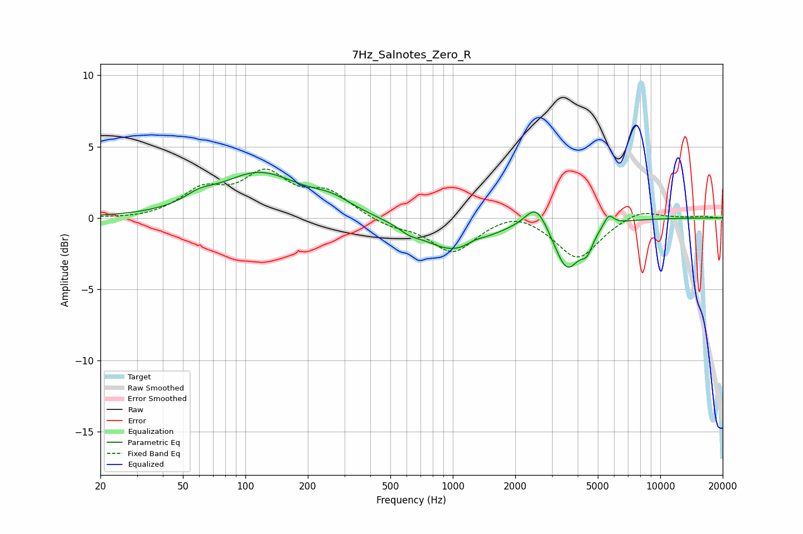

# 7Hz_Salnotes_Zero_R
See [usage instructions](https://github.com/jaakkopasanen/AutoEq#usage) for more options and info.

### Parametric EQs
Apply preamp of -3.3 dB when using parametric equalizer.

|   # | Type    |   Fc (Hz) |    Q |   Gain (dB) |
|-----|---------|-----------|------|-------------|
|   1 | Peaking |        60 | 2.09 |         0.6 |
|   2 | Peaking |       117 | 0.73 |         3.1 |
|   3 | Peaking |       261 | 1.42 |         0.8 |
|   4 | Peaking |       617 | 2.87 |        -0.4 |
|   5 | Peaking |      1006 | 0.95 |        -2.3 |
|   6 | Peaking |      1276 | 3.49 |         0.3 |
|   7 | Peaking |      2525 | 2.67 |         1.8 |
|   8 | Peaking |      3553 | 2.28 |        -3.4 |
|   9 | Peaking |      4436 | 4.77 |        -1.2 |
|  10 | Peaking |      5647 | 5.89 |         0.8 |

### Fixed Band EQs
When using fixed band (also called graphic) equalizer, apply preamp of **-3.5 dB** (if available) and set gains manually with these parameters.

|   # | Type    |   Fc (Hz) |    Q |   Gain (dB) |
|-----|---------|-----------|------|-------------|
|   1 | Peaking |        31 | 1.41 |        -0.1 |
|   2 | Peaking |        62 | 1.41 |         1.8 |
|   3 | Peaking |       125 | 1.41 |         2.8 |
|   4 | Peaking |       250 | 1.41 |         1.6 |
|   5 | Peaking |       500 | 1.41 |        -0.6 |
|   6 | Peaking |      1000 | 1.41 |        -2.4 |
|   7 | Peaking |      2000 | 1.41 |         0.7 |
|   8 | Peaking |      4000 | 1.41 |        -2.9 |
|   9 | Peaking |      8000 | 1.41 |         0.7 |
|  10 | Peaking |     16000 | 1.41 |         0.1 |

### Graphs

