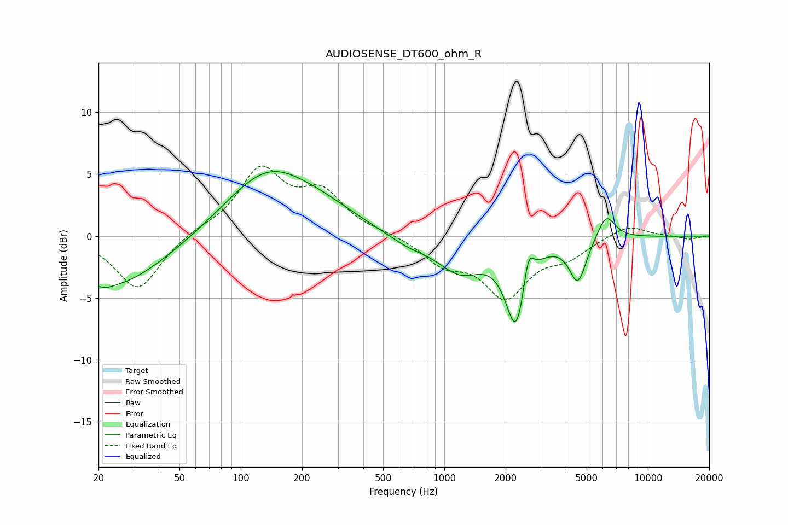

# AUDIOSENSE_DT600_ohm_R
See [usage instructions](https://github.com/jaakkopasanen/AutoEq#usage) for more options and info.

### Parametric EQs
Apply preamp of -5.3 dB when using parametric equalizer.

|   # | Type    |   Fc (Hz) |    Q |   Gain (dB) |
|-----|---------|-----------|------|-------------|
|   1 | Peaking |        22 | 5.74 |        -0.1 |
|   2 | Peaking |        22 | 0.5  |        -4.3 |
|   3 | Peaking |       136 | 0.66 |         5.2 |
|   4 | Peaking |       261 | 0.85 |         0.9 |
|   5 | Peaking |       666 | 1.39 |        -0.7 |
|   6 | Peaking |      1197 | 1.25 |        -2.7 |
|   7 | Peaking |      2261 | 2.73 |        -7   |
|   8 | Peaking |      2582 | 5.43 |         2.9 |
|   9 | Peaking |      4527 | 3.36 |        -3.5 |
|  10 | Peaking |      6235 | 3.11 |         2.1 |

### Fixed Band EQs
When using fixed band (also called graphic) equalizer, apply preamp of **-5.8 dB** (if available) and set gains manually with these parameters.

|   # | Type    |   Fc (Hz) |    Q |   Gain (dB) |
|-----|---------|-----------|------|-------------|
|   1 | Peaking |        31 | 1.41 |        -4.4 |
|   2 | Peaking |        62 | 1.41 |         0.4 |
|   3 | Peaking |       125 | 1.41 |         5.2 |
|   4 | Peaking |       250 | 1.41 |         3.2 |
|   5 | Peaking |       500 | 1.41 |         0.2 |
|   6 | Peaking |      1000 | 1.41 |        -2   |
|   7 | Peaking |      2000 | 1.41 |        -4.6 |
|   8 | Peaking |      4000 | 1.41 |        -1.4 |
|   9 | Peaking |      8000 | 1.41 |         1   |
|  10 | Peaking |     16000 | 1.41 |        -0.3 |

### Graphs

