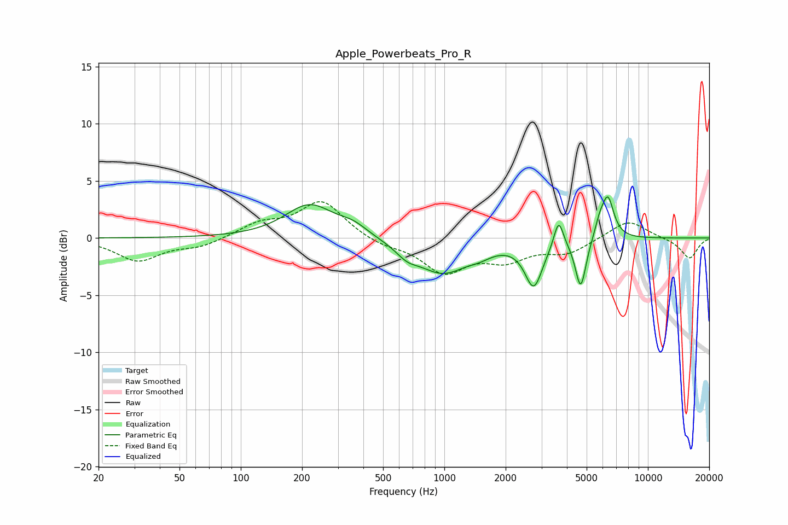

# Apple_Powerbeats_Pro_R
See [usage instructions](https://github.com/jaakkopasanen/AutoEq#usage) for more options and info.

### Parametric EQs
Apply preamp of -3.7 dB when using parametric equalizer.

|   # | Type    |   Fc (Hz) |    Q |   Gain (dB) |
|-----|---------|-----------|------|-------------|
|   1 | Peaking |       218 | 1.18 |         2.9 |
|   2 | Peaking |       357 | 1.98 |         0.8 |
|   3 | Peaking |       655 | 2.56 |        -0.9 |
|   4 | Peaking |       979 | 1.14 |        -2.9 |
|   5 | Peaking |      1494 | 2.37 |        -0.5 |
|   6 | Peaking |      2748 | 3.27 |        -4   |
|   7 | Peaking |      3643 | 6    |         2.5 |
|   8 | Peaking |      4676 | 5.37 |        -4.3 |
|   9 | Peaking |      5787 | 6    |         1.2 |
|  10 | Peaking |      6355 | 4.66 |         3.6 |

### Fixed Band EQs
When using fixed band (also called graphic) equalizer, apply preamp of **-3.3 dB** (if available) and set gains manually with these parameters.

|   # | Type    |   Fc (Hz) |    Q |   Gain (dB) |
|-----|---------|-----------|------|-------------|
|   1 | Peaking |        31 | 1.41 |        -2   |
|   2 | Peaking |        62 | 1.41 |        -0.7 |
|   3 | Peaking |       125 | 1.41 |         1.2 |
|   4 | Peaking |       250 | 1.41 |         3.2 |
|   5 | Peaking |       500 | 1.41 |        -0.6 |
|   6 | Peaking |      1000 | 1.41 |        -2.9 |
|   7 | Peaking |      2000 | 1.41 |        -1.7 |
|   8 | Peaking |      4000 | 1.41 |        -1.2 |
|   9 | Peaking |      8000 | 1.41 |         1.6 |
|  10 | Peaking |     16000 | 1.41 |        -1.8 |

### Graphs

