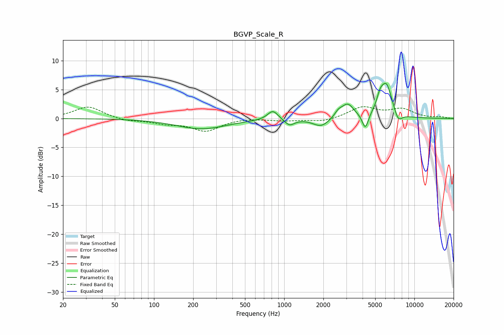

# BGVP_Scale_R
See [usage instructions](https://github.com/jaakkopasanen/AutoEq#usage) for more options and info.

### Parametric EQs
Apply preamp of -6.2 dB when using parametric equalizer.

|   # | Type    |   Fc (Hz) |    Q |   Gain (dB) |
|-----|---------|-----------|------|-------------|
|   1 | Peaking |       232 | 0.73 |        -1.8 |
|   2 | Peaking |       818 | 3.51 |         1.7 |
|   3 | Peaking |      1097 | 3.81 |        -1.1 |
|   4 | Peaking |      1924 | 2.28 |        -1.5 |
|   5 | Peaking |      2606 | 4.78 |         0.9 |
|   6 | Peaking |      3072 | 2.99 |         2.4 |
|   7 | Peaking |      4197 | 5.97 |        -2.7 |
|   8 | Peaking |      5448 | 5.25 |         1.9 |
|   9 | Peaking |      6099 | 3.09 |         5.6 |
|  10 | Peaking |      7520 | 4.57 |        -1.7 |

### Fixed Band EQs
When using fixed band (also called graphic) equalizer, apply preamp of **-2.1 dB** (if available) and set gains manually with these parameters.

|   # | Type    |   Fc (Hz) |    Q |   Gain (dB) |
|-----|---------|-----------|------|-------------|
|   1 | Peaking |        31 | 1.41 |         2.1 |
|   2 | Peaking |        62 | 1.41 |        -0.5 |
|   3 | Peaking |       125 | 1.41 |        -0.7 |
|   4 | Peaking |       250 | 1.41 |        -2.1 |
|   5 | Peaking |       500 | 1.41 |         0.1 |
|   6 | Peaking |      1000 | 1.41 |        -0.3 |
|   7 | Peaking |      2000 | 1.41 |        -0.6 |
|   8 | Peaking |      4000 | 1.41 |         1.9 |
|   9 | Peaking |      8000 | 1.41 |         1.5 |
|  10 | Peaking |     16000 | 1.41 |         0.2 |

### Graphs

