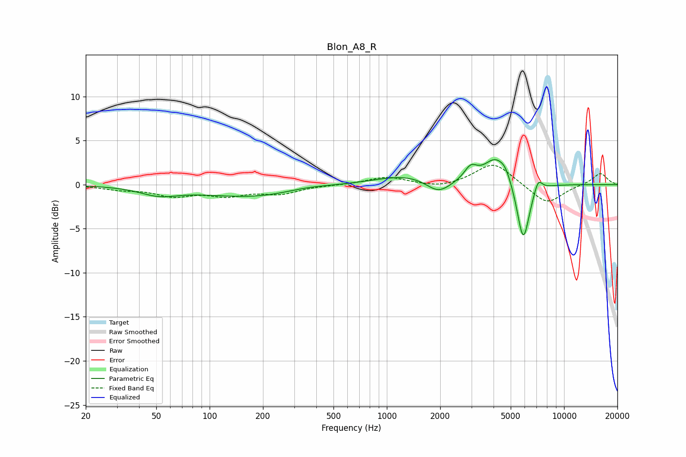

# Blon_A8_R
See [usage instructions](https://github.com/jaakkopasanen/AutoEq#usage) for more options and info.

### Parametric EQs
Apply preamp of -2.9 dB when using parametric equalizer.

|   # | Type    |   Fc (Hz) |    Q |   Gain (dB) |
|-----|---------|-----------|------|-------------|
|   1 | Peaking |        52 | 1.33 |        -0.9 |
|   2 | Peaking |       181 | 0.47 |        -1.4 |
|   3 | Peaking |       354 | 0.98 |         0.5 |
|   4 | Peaking |      1378 | 0.71 |         1.2 |
|   5 | Peaking |      1954 | 1.9  |        -1.8 |
|   6 | Peaking |      2974 | 3.94 |         1.4 |
|   7 | Peaking |      4108 | 2.1  |         2.9 |
|   8 | Peaking |      4678 | 4.51 |         0.9 |
|   9 | Peaking |      5885 | 3.91 |        -6.9 |
|  10 | Peaking |      7145 | 5.95 |         1.5 |

### Fixed Band EQs
When using fixed band (also called graphic) equalizer, apply preamp of **-2.3 dB** (if available) and set gains manually with these parameters.

|   # | Type    |   Fc (Hz) |    Q |   Gain (dB) |
|-----|---------|-----------|------|-------------|
|   1 | Peaking |        31 | 1.41 |        -0.5 |
|   2 | Peaking |        62 | 1.41 |        -1.1 |
|   3 | Peaking |       125 | 1.41 |        -1.1 |
|   4 | Peaking |       250 | 1.41 |        -0.9 |
|   5 | Peaking |       500 | 1.41 |        -0   |
|   6 | Peaking |      1000 | 1.41 |         0.9 |
|   7 | Peaking |      2000 | 1.41 |        -0.4 |
|   8 | Peaking |      4000 | 1.41 |         2.5 |
|   9 | Peaking |      8000 | 1.41 |        -2.3 |
|  10 | Peaking |     16000 | 1.41 |         1.3 |

### Graphs

