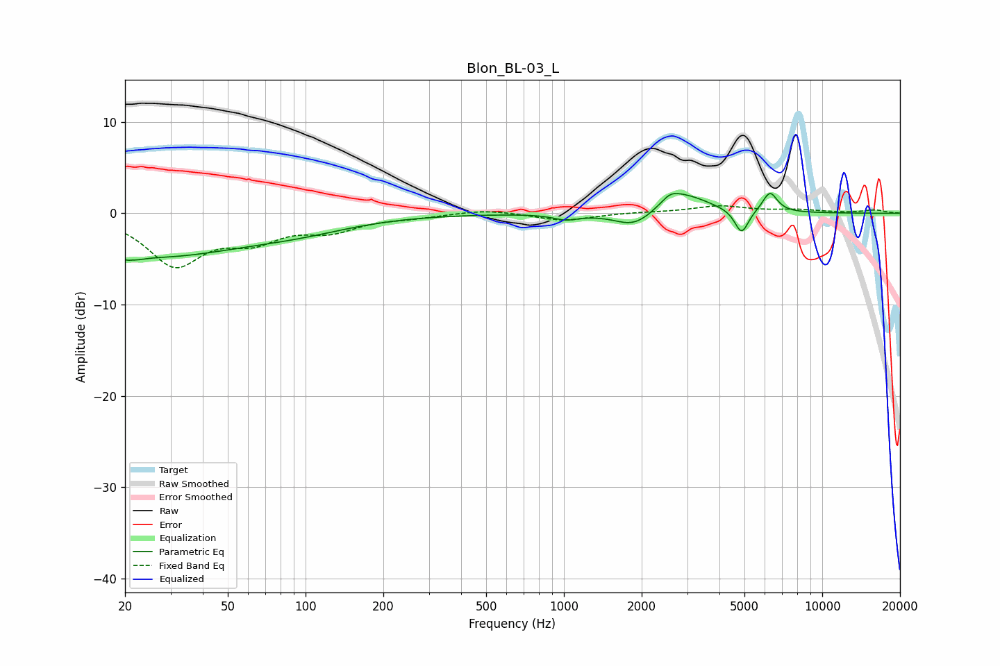

# Blon_BL-03_L
See [usage instructions](https://github.com/jaakkopasanen/AutoEq#usage) for more options and info.

### Parametric EQs
Apply preamp of -2.3 dB when using parametric equalizer.

|   # | Type    |   Fc (Hz) |    Q |   Gain (dB) |
|-----|---------|-----------|------|-------------|
|   1 | Peaking |        21 | 5.27 |        -3.9 |
|   2 | Peaking |        21 | 5.72 |         3.3 |
|   3 | Peaking |        25 | 0.4  |        -4.5 |
|   4 | Peaking |        95 | 0.65 |        -1.2 |
|   5 | Peaking |      1019 | 2.85 |        -0.6 |
|   6 | Peaking |      1876 | 1.85 |        -1.8 |
|   7 | Peaking |      2583 | 3.95 |         0.9 |
|   8 | Peaking |      2895 | 1.4  |         2.1 |
|   9 | Peaking |      4875 | 5.24 |        -2.7 |
|  10 | Peaking |      6277 | 4.83 |         2.2 |

### Fixed Band EQs
When using fixed band (also called graphic) equalizer, apply preamp of **-0.9 dB** (if available) and set gains manually with these parameters.

|   # | Type    |   Fc (Hz) |    Q |   Gain (dB) |
|-----|---------|-----------|------|-------------|
|   1 | Peaking |        31 | 1.41 |        -5.4 |
|   2 | Peaking |        62 | 1.41 |        -2.5 |
|   3 | Peaking |       125 | 1.41 |        -1.7 |
|   4 | Peaking |       250 | 1.41 |        -0.4 |
|   5 | Peaking |       500 | 1.41 |         0.5 |
|   6 | Peaking |      1000 | 1.41 |        -0.8 |
|   7 | Peaking |      2000 | 1.41 |         0.1 |
|   8 | Peaking |      4000 | 1.41 |         0.8 |
|   9 | Peaking |      8000 | 1.41 |         0.3 |
|  10 | Peaking |     16000 | 1.41 |         0.3 |

### Graphs

