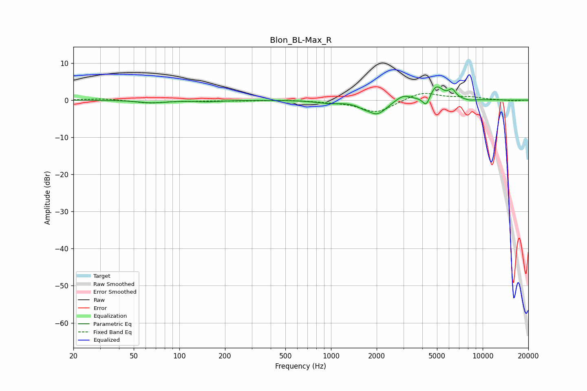

# Blon_BL-Max_R
See [usage instructions](https://github.com/jaakkopasanen/AutoEq#usage) for more options and info.

### Parametric EQs
Apply preamp of -3.6 dB when using parametric equalizer.

|   # | Type    |   Fc (Hz) |    Q |   Gain (dB) |
|-----|---------|-----------|------|-------------|
|   1 | Peaking |        67 | 1.61 |        -0.7 |
|   2 | Peaking |       154 | 1.61 |        -0.4 |
|   3 | Peaking |       968 | 1.76 |        -0.7 |
|   4 | Peaking |      1625 | 4.23 |        -0.6 |
|   5 | Peaking |      2013 | 2.24 |        -3.8 |
|   6 | Peaking |      2990 | 2.78 |         1.6 |
|   7 | Peaking |      4253 | 5.8  |        -3.1 |
|   8 | Peaking |      4932 | 3.03 |         4   |
|   9 | Peaking |      6298 | 5.92 |         2.1 |
|  10 | Peaking |      8202 | 4.27 |        -0.3 |

### Fixed Band EQs
When using fixed band (also called graphic) equalizer, apply preamp of **-1.9 dB** (if available) and set gains manually with these parameters.

|   # | Type    |   Fc (Hz) |    Q |   Gain (dB) |
|-----|---------|-----------|------|-------------|
|   1 | Peaking |        31 | 1.41 |         0.4 |
|   2 | Peaking |        62 | 1.41 |        -0.8 |
|   3 | Peaking |       125 | 1.41 |        -0.2 |
|   4 | Peaking |       250 | 1.41 |        -0.2 |
|   5 | Peaking |       500 | 1.41 |         0.1 |
|   6 | Peaking |      1000 | 1.41 |        -0.3 |
|   7 | Peaking |      2000 | 1.41 |        -3.4 |
|   8 | Peaking |      4000 | 1.41 |         2.2 |
|   9 | Peaking |      8000 | 1.41 |         0.8 |
|  10 | Peaking |     16000 | 1.41 |        -0.2 |

### Graphs

