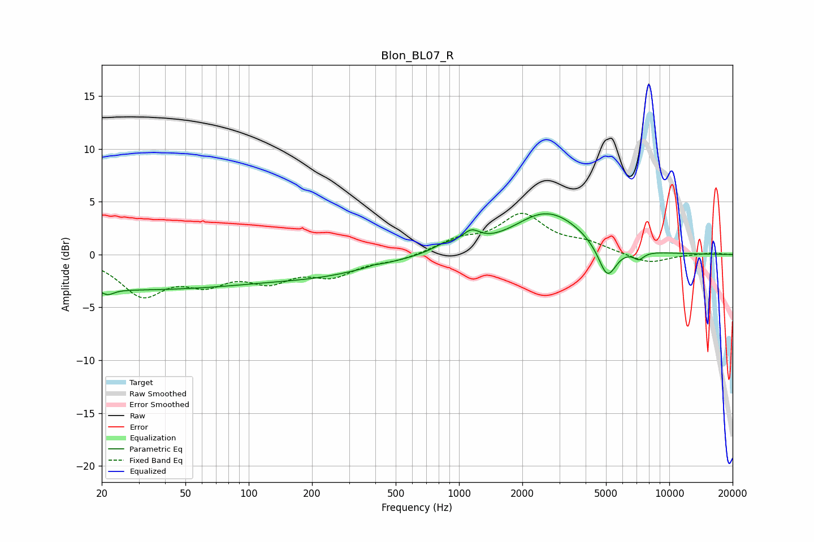

# Blon_BL07_R
See [usage instructions](https://github.com/jaakkopasanen/AutoEq#usage) for more options and info.

### Parametric EQs
Apply preamp of -3.9 dB when using parametric equalizer.

|   # | Type    |   Fc (Hz) |    Q |   Gain (dB) |
|-----|---------|-----------|------|-------------|
|   1 | Peaking |        21 | 5.1  |        -0.5 |
|   2 | Peaking |        25 | 0.18 |        -3.3 |
|   3 | Peaking |       235 | 0.57 |        -1.2 |
|   4 | Peaking |       394 | 5.87 |         0.1 |
|   5 | Peaking |       852 | 2.28 |         0.7 |
|   6 | Peaking |      1143 | 3.3  |         1.3 |
|   7 | Peaking |      2660 | 0.91 |         4.2 |
|   8 | Peaking |      2721 | 1.96 |        -0.2 |
|   9 | Peaking |      5071 | 3.21 |        -3.2 |
|  10 | Peaking |      7160 | 5.24 |        -0.7 |

### Fixed Band EQs
When using fixed band (also called graphic) equalizer, apply preamp of **-4.0 dB** (if available) and set gains manually with these parameters.

|   # | Type    |   Fc (Hz) |    Q |   Gain (dB) |
|-----|---------|-----------|------|-------------|
|   1 | Peaking |        31 | 1.41 |        -3.6 |
|   2 | Peaking |        62 | 1.41 |        -2.2 |
|   3 | Peaking |       125 | 1.41 |        -2.1 |
|   4 | Peaking |       250 | 1.41 |        -1.8 |
|   5 | Peaking |       500 | 1.41 |        -0.5 |
|   6 | Peaking |      1000 | 1.41 |         1.2 |
|   7 | Peaking |      2000 | 1.41 |         3.6 |
|   8 | Peaking |      4000 | 1.41 |         0.9 |
|   9 | Peaking |      8000 | 1.41 |        -0.9 |
|  10 | Peaking |     16000 | 1.41 |         0.2 |

### Graphs

