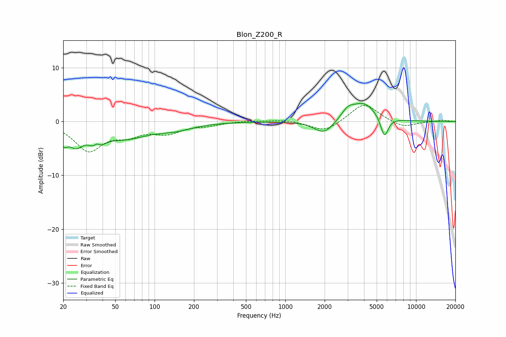

# Blon_Z200_R
See [usage instructions](https://github.com/jaakkopasanen/AutoEq#usage) for more options and info.

### Parametric EQs
Apply preamp of -3.5 dB when using parametric equalizer.

|   # | Type    |   Fc (Hz) |    Q |   Gain (dB) |
|-----|---------|-----------|------|-------------|
|   1 | Peaking |        20 | 4.99 |        -2.5 |
|   2 | Peaking |        25 | 2.5  |        -3.2 |
|   3 | Peaking |        36 | 3.15 |        -4   |
|   4 | Peaking |        36 | 5.33 |         2.4 |
|   5 | Peaking |        59 | 0.77 |        -2.8 |
|   6 | Peaking |       145 | 1.07 |        -1.1 |
|   7 | Peaking |      1977 | 1.89 |        -2.5 |
|   8 | Peaking |      3004 | 2.99 |         1.5 |
|   9 | Peaking |      3971 | 1.43 |         3.5 |
|  10 | Peaking |      5728 | 4.63 |        -3.9 |

### Fixed Band EQs
When using fixed band (also called graphic) equalizer, apply preamp of **-3.1 dB** (if available) and set gains manually with these parameters.

|   # | Type    |   Fc (Hz) |    Q |   Gain (dB) |
|-----|---------|-----------|------|-------------|
|   1 | Peaking |        31 | 1.41 |        -5.2 |
|   2 | Peaking |        62 | 1.41 |        -2   |
|   3 | Peaking |       125 | 1.41 |        -1.9 |
|   4 | Peaking |       250 | 1.41 |        -0.6 |
|   5 | Peaking |       500 | 1.41 |         0.2 |
|   6 | Peaking |      1000 | 1.41 |         0.4 |
|   7 | Peaking |      2000 | 1.41 |        -2   |
|   8 | Peaking |      4000 | 1.41 |         3.5 |
|   9 | Peaking |      8000 | 1.41 |        -1.2 |
|  10 | Peaking |     16000 | 1.41 |         0.3 |

### Graphs

