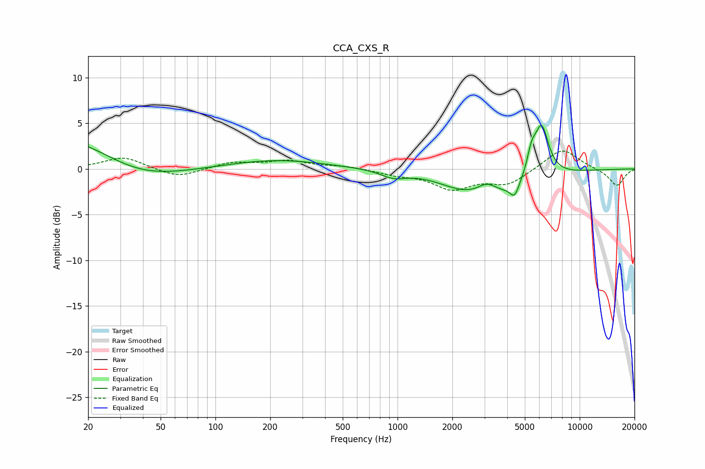

# CCA_CXS_R
See [usage instructions](https://github.com/jaakkopasanen/AutoEq#usage) for more options and info.

### Parametric EQs
Apply preamp of -4.8 dB when using parametric equalizer.

|   # | Type    |   Fc (Hz) |    Q |   Gain (dB) |
|-----|---------|-----------|------|-------------|
|   1 | Peaking |        20 | 0.36 |         5.9 |
|   2 | Peaking |        35 | 0.51 |        -4.8 |
|   3 | Peaking |       214 | 0.52 |         1   |
|   4 | Peaking |       946 | 2.08 |        -0.8 |
|   5 | Peaking |      2254 | 1.06 |        -1.2 |
|   6 | Peaking |      3107 | 2.7  |         1.2 |
|   7 | Peaking |      3822 | 0.78 |        -2.5 |
|   8 | Peaking |      4392 | 5.81 |        -1.4 |
|   9 | Peaking |      5440 | 5.53 |         2.2 |
|  10 | Peaking |      6175 | 3.41 |         5.7 |

### Fixed Band EQs
When using fixed band (also called graphic) equalizer, apply preamp of **-2.0 dB** (if available) and set gains manually with these parameters.

|   # | Type    |   Fc (Hz) |    Q |   Gain (dB) |
|-----|---------|-----------|------|-------------|
|   1 | Peaking |        31 | 1.41 |         1.3 |
|   2 | Peaking |        62 | 1.41 |        -1   |
|   3 | Peaking |       125 | 1.41 |         0.7 |
|   4 | Peaking |       250 | 1.41 |         0.8 |
|   5 | Peaking |       500 | 1.41 |         0.3 |
|   6 | Peaking |      1000 | 1.41 |        -0.5 |
|   7 | Peaking |      2000 | 1.41 |        -2.1 |
|   8 | Peaking |      4000 | 1.41 |        -1.6 |
|   9 | Peaking |      8000 | 1.41 |         2.3 |
|  10 | Peaking |     16000 | 1.41 |        -1.9 |

### Graphs

