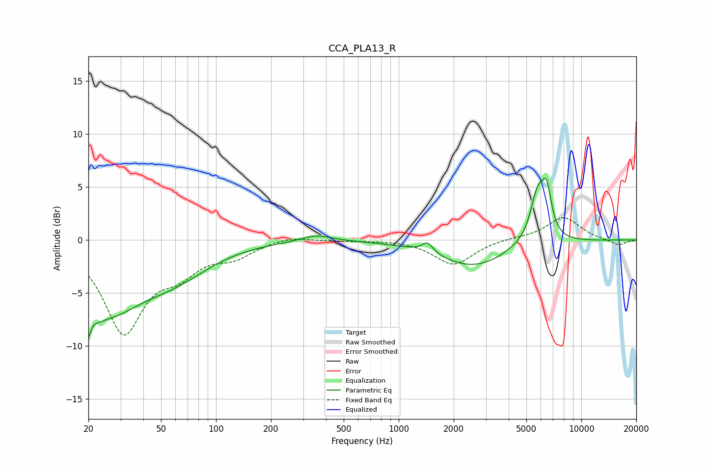

# CCA_PLA13_R
See [usage instructions](https://github.com/jaakkopasanen/AutoEq#usage) for more options and info.

### Parametric EQs
Apply preamp of -5.9 dB when using parametric equalizer.

|   # | Type    |   Fc (Hz) |    Q |   Gain (dB) |
|-----|---------|-----------|------|-------------|
|   1 | Peaking |        20 | 3.98 |        -7.1 |
|   2 | Peaking |        21 | 5.14 |         3.7 |
|   3 | Peaking |        26 | 0.75 |        -5.7 |
|   4 | Peaking |        60 | 0.72 |        -2.5 |
|   5 | Peaking |       353 | 1.62 |         0.6 |
|   6 | Peaking |      1437 | 4.71 |         1   |
|   7 | Peaking |      2555 | 0.76 |        -2.5 |
|   8 | Peaking |      4031 | 5.51 |         0.1 |
|   9 | Peaking |      5762 | 3.35 |         4.5 |
|  10 | Peaking |      6465 | 5.13 |         3.7 |

### Fixed Band EQs
When using fixed band (also called graphic) equalizer, apply preamp of **-2.2 dB** (if available) and set gains manually with these parameters.

|   # | Type    |   Fc (Hz) |    Q |   Gain (dB) |
|-----|---------|-----------|------|-------------|
|   1 | Peaking |        31 | 1.41 |        -8.5 |
|   2 | Peaking |        62 | 1.41 |        -2.3 |
|   3 | Peaking |       125 | 1.41 |        -1.3 |
|   4 | Peaking |       250 | 1.41 |         0.4 |
|   5 | Peaking |       500 | 1.41 |        -0.1 |
|   6 | Peaking |      1000 | 1.41 |         0.1 |
|   7 | Peaking |      2000 | 1.41 |        -2.4 |
|   8 | Peaking |      4000 | 1.41 |         0.2 |
|   9 | Peaking |      8000 | 1.41 |         2.2 |
|  10 | Peaking |     16000 | 1.41 |        -0.5 |

### Graphs

