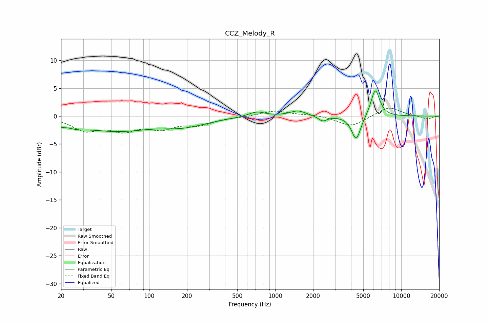

# CCZ_Melody_R
See [usage instructions](https://github.com/jaakkopasanen/AutoEq#usage) for more options and info.

### Parametric EQs
Apply preamp of -4.6 dB when using parametric equalizer.

|   # | Type    |   Fc (Hz) |    Q |   Gain (dB) |
|-----|---------|-----------|------|-------------|
|   1 | Peaking |        20 | 4.54 |        -0.6 |
|   2 | Peaking |        26 | 1.59 |        -1.1 |
|   3 | Peaking |        55 | 0.68 |        -2.8 |
|   4 | Peaking |        56 | 1.24 |         0.5 |
|   5 | Peaking |       185 | 0.73 |        -1.7 |
|   6 | Peaking |       713 | 2.15 |         0.9 |
|   7 | Peaking |      1516 | 2.19 |         1   |
|   8 | Peaking |      2380 | 4.11 |        -0.9 |
|   9 | Peaking |      4395 | 3.83 |        -4.4 |
|  10 | Peaking |      6222 | 3.91 |         5   |

### Fixed Band EQs
When using fixed band (also called graphic) equalizer, apply preamp of **-1.5 dB** (if available) and set gains manually with these parameters.

|   # | Type    |   Fc (Hz) |    Q |   Gain (dB) |
|-----|---------|-----------|------|-------------|
|   1 | Peaking |        31 | 1.41 |        -2.4 |
|   2 | Peaking |        62 | 1.41 |        -2.2 |
|   3 | Peaking |       125 | 1.41 |        -1.9 |
|   4 | Peaking |       250 | 1.41 |        -1.4 |
|   5 | Peaking |       500 | 1.41 |        -0.1 |
|   6 | Peaking |      1000 | 1.41 |         1   |
|   7 | Peaking |      2000 | 1.41 |         0.3 |
|   8 | Peaking |      4000 | 1.41 |        -1.9 |
|   9 | Peaking |      8000 | 1.41 |         1.7 |
|  10 | Peaking |     16000 | 1.41 |        -0.5 |

### Graphs

