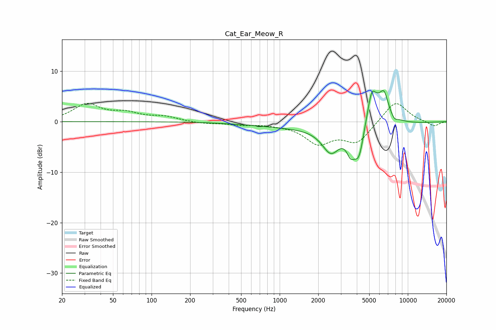

# Cat_Ear_Meow_R
See [usage instructions](https://github.com/jaakkopasanen/AutoEq#usage) for more options and info.

### Parametric EQs
Apply preamp of -6.3 dB when using parametric equalizer.

|   # | Type    |   Fc (Hz) |    Q |   Gain (dB) |
|-----|---------|-----------|------|-------------|
|   1 | Peaking |      2510 | 2.06 |        -4.8 |
|   2 | Peaking |      2611 | 0.23 |        -1.3 |
|   3 | Peaking |      3571 | 4.54 |        -3.1 |
|   4 | Peaking |      4157 | 3.17 |        -7.5 |
|   5 | Peaking |      4949 | 2.86 |         0.3 |
|   6 | Peaking |      5218 | 5.48 |         2.9 |
|   7 | Peaking |      5436 | 1.63 |         6.1 |
|   8 | Peaking |      6530 | 4.42 |         3.3 |
|   9 | Peaking |      6581 | 3.51 |         0.4 |
|  10 | Peaking |      7836 | 5.55 |        -0.9 |

### Fixed Band EQs
When using fixed band (also called graphic) equalizer, apply preamp of **-3.7 dB** (if available) and set gains manually with these parameters.

|   # | Type    |   Fc (Hz) |    Q |   Gain (dB) |
|-----|---------|-----------|------|-------------|
|   1 | Peaking |        31 | 1.41 |         3.3 |
|   2 | Peaking |        62 | 1.41 |         1.5 |
|   3 | Peaking |       125 | 1.41 |         0.9 |
|   4 | Peaking |       250 | 1.41 |        -0.4 |
|   5 | Peaking |       500 | 1.41 |        -0.5 |
|   6 | Peaking |      1000 | 1.41 |        -0.3 |
|   7 | Peaking |      2000 | 1.41 |        -4   |
|   8 | Peaking |      4000 | 1.41 |        -4   |
|   9 | Peaking |      8000 | 1.41 |         4.3 |
|  10 | Peaking |     16000 | 1.41 |        -1   |

### Graphs

