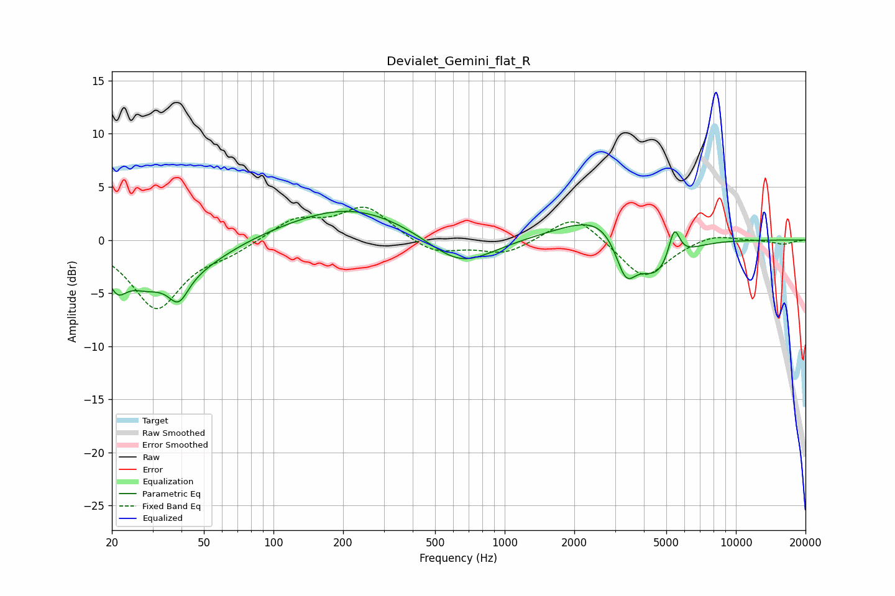

# Devialet_Gemini_flat_R
See [usage instructions](https://github.com/jaakkopasanen/AutoEq#usage) for more options and info.

### Parametric EQs
Apply preamp of -2.8 dB when using parametric equalizer.

|   # | Type    |   Fc (Hz) |    Q |   Gain (dB) |
|-----|---------|-----------|------|-------------|
|   1 | Peaking |        21 | 3.34 |        -2.8 |
|   2 | Peaking |        28 | 1.51 |        -2.8 |
|   3 | Peaking |        39 | 3.2  |        -2.7 |
|   4 | Peaking |        46 | 0.92 |        -2.1 |
|   5 | Peaking |       217 | 0.52 |         3.2 |
|   6 | Peaking |       642 | 0.98 |        -3.1 |
|   7 | Peaking |      2990 | 0.78 |         3.8 |
|   8 | Peaking |      3335 | 3.02 |        -4.2 |
|   9 | Peaking |      4472 | 1.38 |        -5.1 |
|  10 | Peaking |      5410 | 5.67 |         3.2 |

### Fixed Band EQs
When using fixed band (also called graphic) equalizer, apply preamp of **-3.2 dB** (if available) and set gains manually with these parameters.

|   # | Type    |   Fc (Hz) |    Q |   Gain (dB) |
|-----|---------|-----------|------|-------------|
|   1 | Peaking |        31 | 1.41 |        -6.4 |
|   2 | Peaking |        62 | 1.41 |        -1   |
|   3 | Peaking |       125 | 1.41 |         1.9 |
|   4 | Peaking |       250 | 1.41 |         3.1 |
|   5 | Peaking |       500 | 1.41 |        -1.4 |
|   6 | Peaking |      1000 | 1.41 |        -1.3 |
|   7 | Peaking |      2000 | 1.41 |         2.6 |
|   8 | Peaking |      4000 | 1.41 |        -3.7 |
|   9 | Peaking |      8000 | 1.41 |         0.7 |
|  10 | Peaking |     16000 | 1.41 |        -0.4 |

### Graphs

