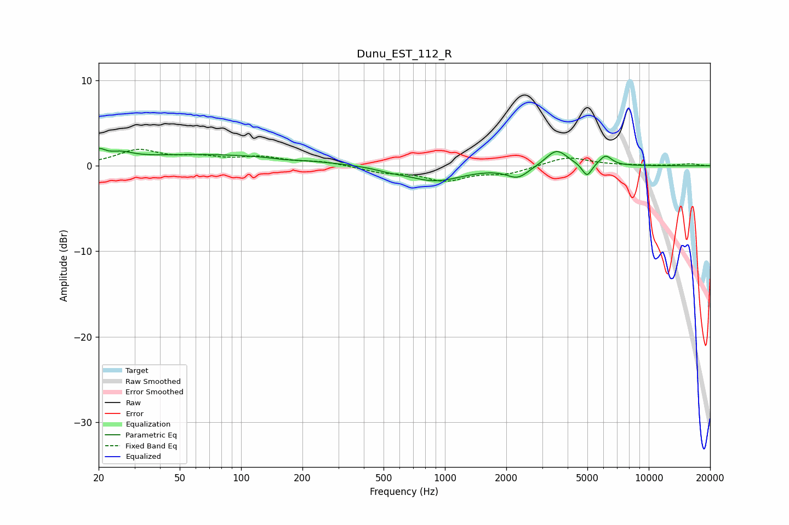

# Dunu_EST_112_R
See [usage instructions](https://github.com/jaakkopasanen/AutoEq#usage) for more options and info.

### Parametric EQs
Apply preamp of -2.1 dB when using parametric equalizer.

|   # | Type    |   Fc (Hz) |    Q |   Gain (dB) |
|-----|---------|-----------|------|-------------|
|   1 | Peaking |        20 | 4.4  |         1.1 |
|   2 | Peaking |        26 | 2.53 |         0.7 |
|   3 | Peaking |        68 | 0.31 |         1.3 |
|   4 | Peaking |       161 | 2.24 |        -0.2 |
|   5 | Peaking |       532 | 2.35 |        -0.2 |
|   6 | Peaking |       889 | 1.03 |        -1.8 |
|   7 | Peaking |      2278 | 2.65 |        -1.3 |
|   8 | Peaking |      3530 | 2.65 |         2   |
|   9 | Peaking |      4976 | 5.99 |        -1.5 |
|  10 | Peaking |      6141 | 4.53 |         1.2 |

### Fixed Band EQs
When using fixed band (also called graphic) equalizer, apply preamp of **-2.0 dB** (if available) and set gains manually with these parameters.

|   # | Type    |   Fc (Hz) |    Q |   Gain (dB) |
|-----|---------|-----------|------|-------------|
|   1 | Peaking |        31 | 1.41 |         1.7 |
|   2 | Peaking |        62 | 1.41 |         0.8 |
|   3 | Peaking |       125 | 1.41 |         0.9 |
|   4 | Peaking |       250 | 1.41 |         0.4 |
|   5 | Peaking |       500 | 1.41 |        -0.7 |
|   6 | Peaking |      1000 | 1.41 |        -1.6 |
|   7 | Peaking |      2000 | 1.41 |        -0.8 |
|   8 | Peaking |      4000 | 1.41 |         1.1 |
|   9 | Peaking |      8000 | 1.41 |         0   |
|  10 | Peaking |     16000 | 1.41 |         0.2 |

### Graphs

