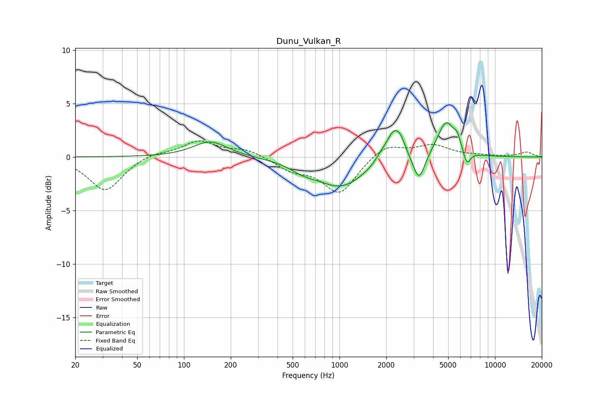

# Dunu_Vulkan_R
See [usage instructions](https://github.com/jaakkopasanen/AutoEq#usage) for more options and info.

### Parametric EQs
Apply preamp of -3.3 dB when using parametric equalizer.

|   # | Type    |   Fc (Hz) |    Q |   Gain (dB) |
|-----|---------|-----------|------|-------------|
|   1 | Peaking |       148 | 1.3  |         1.5 |
|   2 | Peaking |       583 | 1.74 |        -0.6 |
|   3 | Peaking |      1023 | 0.9  |        -2.8 |
|   4 | Peaking |      1834 | 4.08 |         0.4 |
|   5 | Peaking |      2248 | 2.69 |         3   |
|   6 | Peaking |      2488 | 5.54 |         0.6 |
|   7 | Peaking |      3245 | 3.74 |        -2.6 |
|   8 | Peaking |      4840 | 2.49 |         3.3 |
|   9 | Peaking |      5719 | 6    |         0.9 |
|  10 | Peaking |      6598 | 6    |        -1.4 |

### Fixed Band EQs
When using fixed band (also called graphic) equalizer, apply preamp of **-1.6 dB** (if available) and set gains manually with these parameters.

|   # | Type    |   Fc (Hz) |    Q |   Gain (dB) |
|-----|---------|-----------|------|-------------|
|   1 | Peaking |        31 | 1.41 |        -3.2 |
|   2 | Peaking |        62 | 1.41 |         0.4 |
|   3 | Peaking |       125 | 1.41 |         1.5 |
|   4 | Peaking |       250 | 1.41 |         0.7 |
|   5 | Peaking |       500 | 1.41 |        -1.1 |
|   6 | Peaking |      1000 | 1.41 |        -3.4 |
|   7 | Peaking |      2000 | 1.41 |         1.3 |
|   8 | Peaking |      4000 | 1.41 |         1.1 |
|   9 | Peaking |      8000 | 1.41 |         0.1 |
|  10 | Peaking |     16000 | 1.41 |         0.4 |

### Graphs

