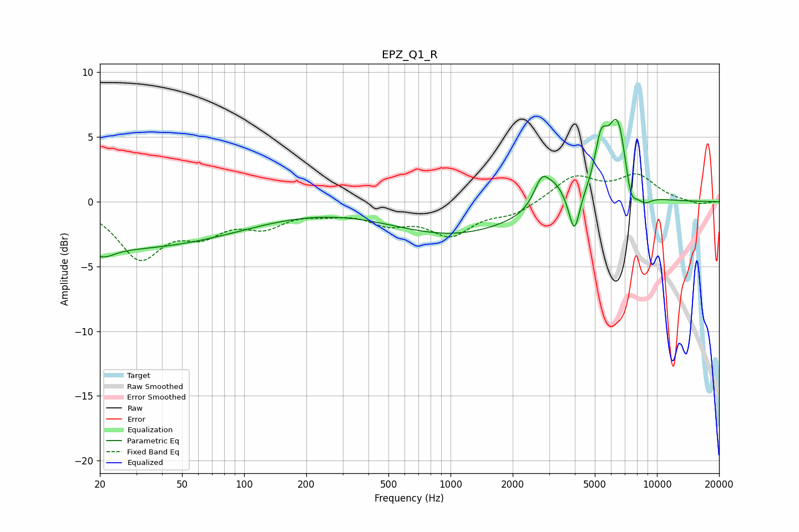

# EPZ_Q1_R
See [usage instructions](https://github.com/jaakkopasanen/AutoEq#usage) for more options and info.

### Parametric EQs
Apply preamp of -6.4 dB when using parametric equalizer.

|   # | Type    |   Fc (Hz) |    Q |   Gain (dB) |
|-----|---------|-----------|------|-------------|
|   1 | Peaking |        21 | 2.67 |        -0.7 |
|   2 | Peaking |        25 | 0.22 |        -3.6 |
|   3 | Peaking |      1036 | 0.45 |        -2.5 |
|   4 | Peaking |      2769 | 3.59 |         2.3 |
|   5 | Peaking |      3239 | 3.02 |         1.3 |
|   6 | Peaking |      3978 | 5.7  |        -3   |
|   7 | Peaking |      5354 | 4.61 |         3.3 |
|   8 | Peaking |      6463 | 2.67 |         6.7 |
|   9 | Peaking |      7433 | 4.41 |        -2.6 |
|  10 | Peaking |      8638 | 3.28 |        -0.8 |

### Fixed Band EQs
When using fixed band (also called graphic) equalizer, apply preamp of **-2.2 dB** (if available) and set gains manually with these parameters.

|   # | Type    |   Fc (Hz) |    Q |   Gain (dB) |
|-----|---------|-----------|------|-------------|
|   1 | Peaking |        31 | 1.41 |        -4.1 |
|   2 | Peaking |        62 | 1.41 |        -2   |
|   3 | Peaking |       125 | 1.41 |        -1.6 |
|   4 | Peaking |       250 | 1.41 |        -0.6 |
|   5 | Peaking |       500 | 1.41 |        -1.4 |
|   6 | Peaking |      1000 | 1.41 |        -2.3 |
|   7 | Peaking |      2000 | 1.41 |        -0.9 |
|   8 | Peaking |      4000 | 1.41 |         1.9 |
|   9 | Peaking |      8000 | 1.41 |         1.9 |
|  10 | Peaking |     16000 | 1.41 |        -0.3 |

### Graphs

