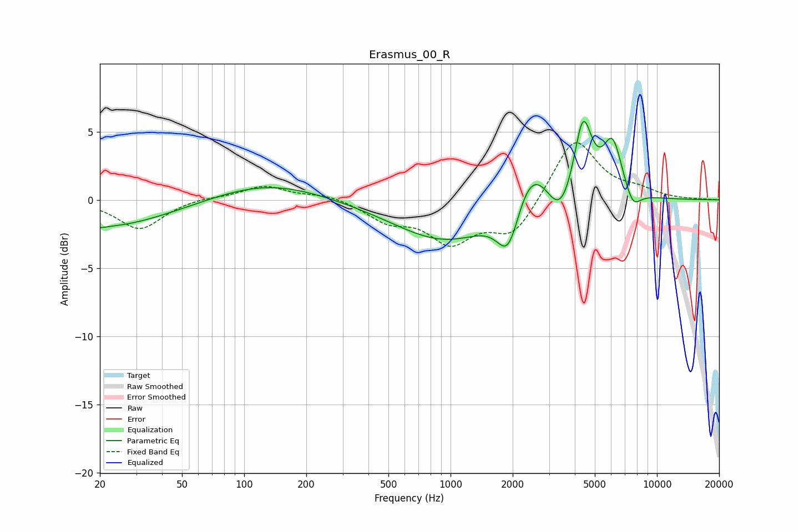

# Erasmus_00_R
See [usage instructions](https://github.com/jaakkopasanen/AutoEq#usage) for more options and info.

### Parametric EQs
Apply preamp of -5.9 dB when using parametric equalizer.

|   # | Type    |   Fc (Hz) |    Q |   Gain (dB) |
|-----|---------|-----------|------|-------------|
|   1 | Peaking |        20 | 0.42 |        -2.1 |
|   2 | Peaking |        20 | 5.75 |        -0.1 |
|   3 | Peaking |       129 | 0.54 |         1.3 |
|   4 | Peaking |       967 | 0.56 |        -3.1 |
|   5 | Peaking |      1911 | 2.47 |        -4   |
|   6 | Peaking |      2436 | 1.37 |         4.2 |
|   7 | Peaking |      3398 | 2.1  |        -2.7 |
|   8 | Peaking |      4379 | 3.17 |         5.8 |
|   9 | Peaking |      6096 | 2.91 |         4   |
|  10 | Peaking |      7634 | 3.53 |        -1.4 |

### Fixed Band EQs
When using fixed band (also called graphic) equalizer, apply preamp of **-4.3 dB** (if available) and set gains manually with these parameters.

|   # | Type    |   Fc (Hz) |    Q |   Gain (dB) |
|-----|---------|-----------|------|-------------|
|   1 | Peaking |        31 | 1.41 |        -2.2 |
|   2 | Peaking |        62 | 1.41 |         0.2 |
|   3 | Peaking |       125 | 1.41 |         1   |
|   4 | Peaking |       250 | 1.41 |         0.4 |
|   5 | Peaking |       500 | 1.41 |        -1.4 |
|   6 | Peaking |      1000 | 1.41 |        -2.9 |
|   7 | Peaking |      2000 | 1.41 |        -2.6 |
|   8 | Peaking |      4000 | 1.41 |         4.6 |
|   9 | Peaking |      8000 | 1.41 |         0.6 |
|  10 | Peaking |     16000 | 1.41 |         0   |

### Graphs

