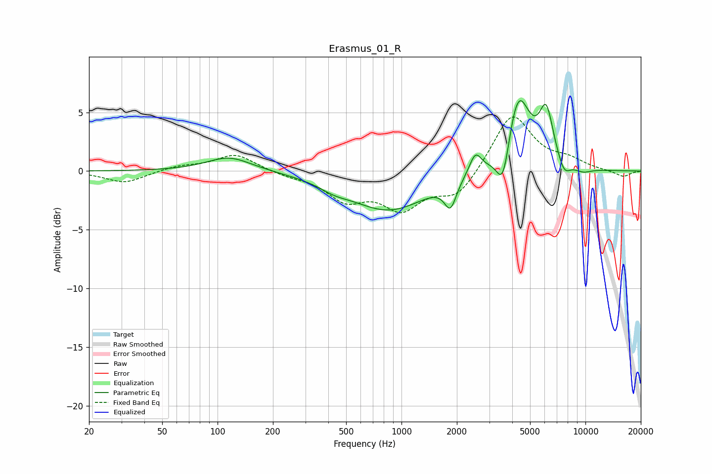

# Erasmus_01_R
See [usage instructions](https://github.com/jaakkopasanen/AutoEq#usage) for more options and info.

### Parametric EQs
Apply preamp of -6.1 dB when using parametric equalizer.

|   # | Type    |   Fc (Hz) |    Q |   Gain (dB) |
|-----|---------|-----------|------|-------------|
|   1 | Peaking |       116 | 1.15 |         1.2 |
|   2 | Peaking |       429 | 1.74 |        -0.5 |
|   3 | Peaking |       854 | 0.67 |        -3.3 |
|   4 | Peaking |      1845 | 4.42 |        -2.2 |
|   5 | Peaking |      2520 | 4.34 |         1.8 |
|   6 | Peaking |      3567 | 3.89 |        -3.8 |
|   7 | Peaking |      4300 | 2.17 |         6.7 |
|   8 | Peaking |      6126 | 3.56 |         4.4 |
|   9 | Peaking |      7655 | 4.09 |        -1.2 |
|  10 | Peaking |      9718 | 2.71 |        -0.4 |

### Fixed Band EQs
When using fixed band (also called graphic) equalizer, apply preamp of **-4.7 dB** (if available) and set gains manually with these parameters.

|   # | Type    |   Fc (Hz) |    Q |   Gain (dB) |
|-----|---------|-----------|------|-------------|
|   1 | Peaking |        31 | 1.41 |        -1   |
|   2 | Peaking |        62 | 1.41 |         0.4 |
|   3 | Peaking |       125 | 1.41 |         1.4 |
|   4 | Peaking |       250 | 1.41 |        -0.3 |
|   5 | Peaking |       500 | 1.41 |        -2.2 |
|   6 | Peaking |      1000 | 1.41 |        -2.9 |
|   7 | Peaking |      2000 | 1.41 |        -2.2 |
|   8 | Peaking |      4000 | 1.41 |         5   |
|   9 | Peaking |      8000 | 1.41 |         0.8 |
|  10 | Peaking |     16000 | 1.41 |        -0.5 |

### Graphs

