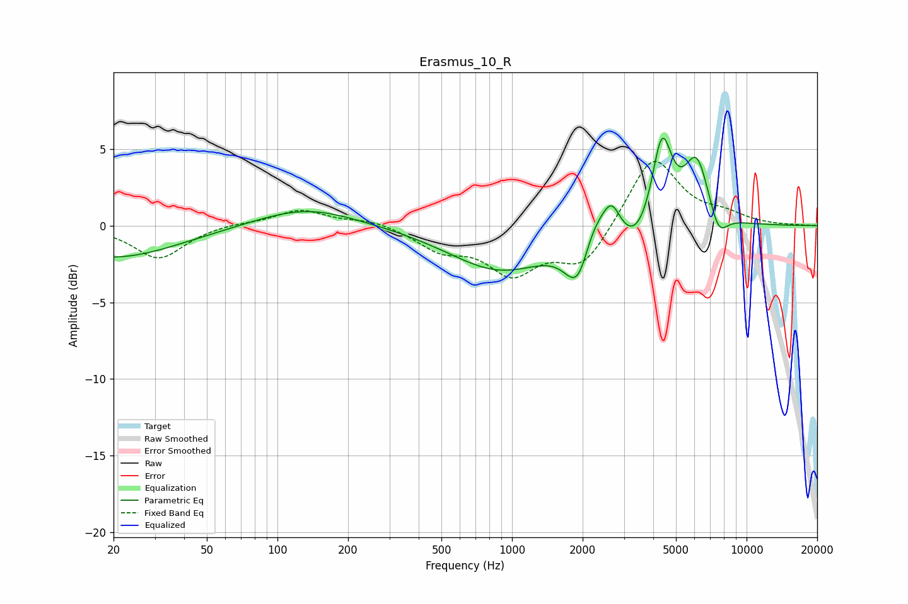

# Erasmus_10_R
See [usage instructions](https://github.com/jaakkopasanen/AutoEq#usage) for more options and info.

### Parametric EQs
Apply preamp of -5.8 dB when using parametric equalizer.

|   # | Type    |   Fc (Hz) |    Q |   Gain (dB) |
|-----|---------|-----------|------|-------------|
|   1 | Peaking |        20 | 0.51 |        -2.1 |
|   2 | Peaking |       133 | 0.68 |         1.2 |
|   3 | Peaking |       892 | 0.65 |        -2.9 |
|   4 | Peaking |      1929 | 2.44 |        -4.5 |
|   5 | Peaking |      2162 | 2.08 |         3.1 |
|   6 | Peaking |      2660 | 3.62 |         2   |
|   7 | Peaking |      3396 | 1.66 |        -1.9 |
|   8 | Peaking |      4353 | 3.2  |         6   |
|   9 | Peaking |      6129 | 2.56 |         4.3 |
|  10 | Peaking |      7589 | 3.51 |        -1.7 |

### Fixed Band EQs
When using fixed band (also called graphic) equalizer, apply preamp of **-4.3 dB** (if available) and set gains manually with these parameters.

|   # | Type    |   Fc (Hz) |    Q |   Gain (dB) |
|-----|---------|-----------|------|-------------|
|   1 | Peaking |        31 | 1.41 |        -2.2 |
|   2 | Peaking |        62 | 1.41 |         0.2 |
|   3 | Peaking |       125 | 1.41 |         1   |
|   4 | Peaking |       250 | 1.41 |         0.4 |
|   5 | Peaking |       500 | 1.41 |        -1.4 |
|   6 | Peaking |      1000 | 1.41 |        -2.9 |
|   7 | Peaking |      2000 | 1.41 |        -2.6 |
|   8 | Peaking |      4000 | 1.41 |         4.6 |
|   9 | Peaking |      8000 | 1.41 |         0.6 |
|  10 | Peaking |     16000 | 1.41 |         0   |

### Graphs

