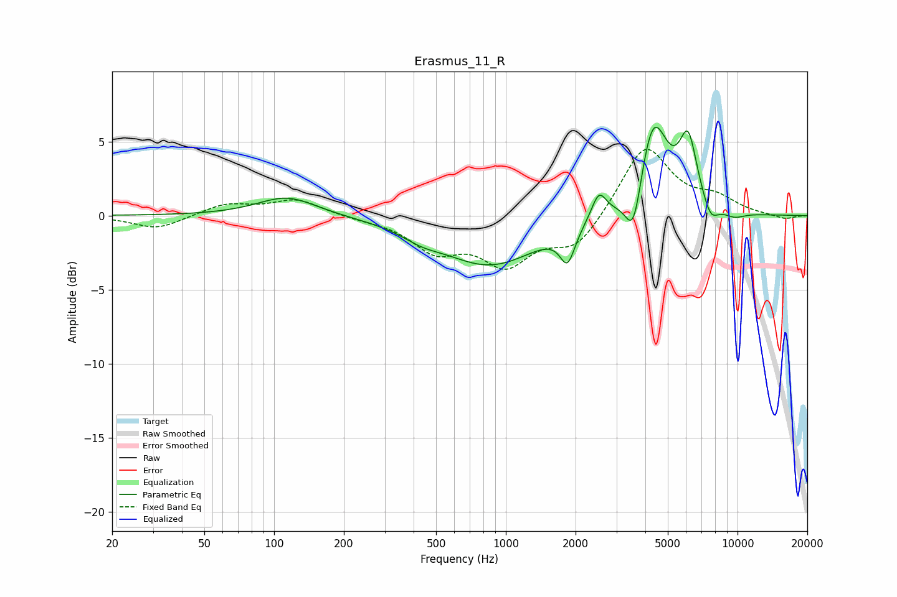

# Erasmus_11_R
See [usage instructions](https://github.com/jaakkopasanen/AutoEq#usage) for more options and info.

### Parametric EQs
Apply preamp of -6.1 dB when using parametric equalizer.

|   # | Type    |   Fc (Hz) |    Q |   Gain (dB) |
|-----|---------|-----------|------|-------------|
|   1 | Peaking |       114 | 1.11 |         1.3 |
|   2 | Peaking |       432 | 1.7  |        -0.5 |
|   3 | Peaking |       856 | 0.67 |        -3.3 |
|   4 | Peaking |      1846 | 4.43 |        -2.2 |
|   5 | Peaking |      2521 | 4.41 |         1.8 |
|   6 | Peaking |      3562 | 3.92 |        -3.7 |
|   7 | Peaking |      4314 | 2.17 |         6.6 |
|   8 | Peaking |      6124 | 3.58 |         4.4 |
|   9 | Peaking |      7650 | 4.07 |        -1.2 |
|  10 | Peaking |      9683 | 2.72 |        -0.4 |

### Fixed Band EQs
When using fixed band (also called graphic) equalizer, apply preamp of **-4.6 dB** (if available) and set gains manually with these parameters.

|   # | Type    |   Fc (Hz) |    Q |   Gain (dB) |
|-----|---------|-----------|------|-------------|
|   1 | Peaking |        31 | 1.41 |        -0.9 |
|   2 | Peaking |        62 | 1.41 |         0.8 |
|   3 | Peaking |       125 | 1.41 |         1.1 |
|   4 | Peaking |       250 | 1.41 |        -0.2 |
|   5 | Peaking |       500 | 1.41 |        -2.2 |
|   6 | Peaking |      1000 | 1.41 |        -3   |
|   7 | Peaking |      2000 | 1.41 |        -2.1 |
|   8 | Peaking |      4000 | 1.41 |         4.8 |
|   9 | Peaking |      8000 | 1.41 |         1   |
|  10 | Peaking |     16000 | 1.41 |        -0.3 |

### Graphs

