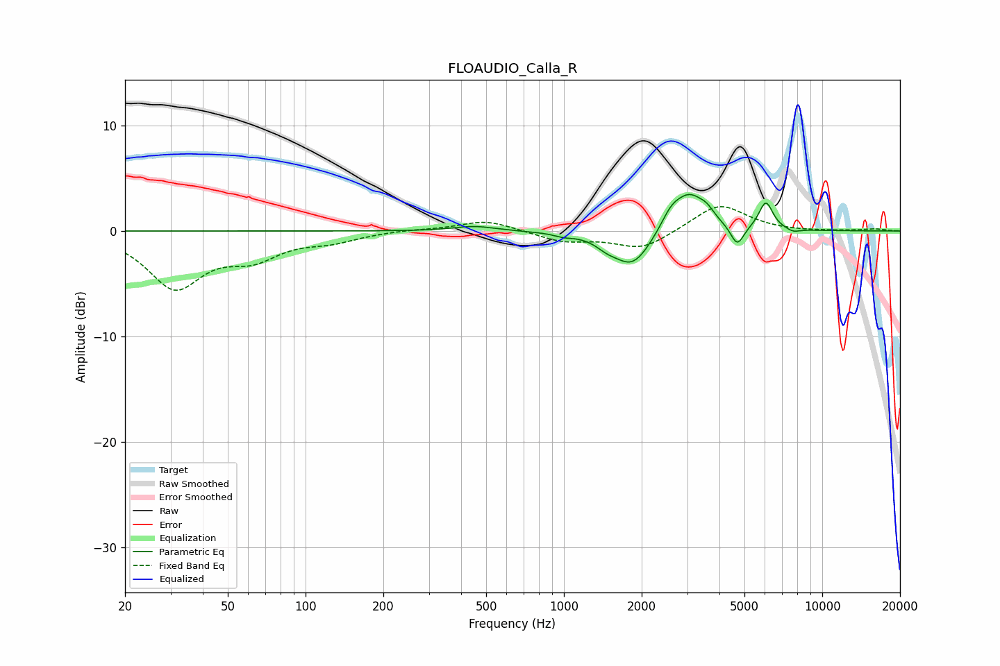

# FLOAUDIO_Calla_R
See [usage instructions](https://github.com/jaakkopasanen/AutoEq#usage) for more options and info.

### Parametric EQs
Apply preamp of -3.6 dB when using parametric equalizer.

|   # | Type    |   Fc (Hz) |    Q |   Gain (dB) |
|-----|---------|-----------|------|-------------|
|   1 | Peaking |       451 | 1.73 |         0.5 |
|   2 | Peaking |       997 | 3.99 |        -0.3 |
|   3 | Peaking |      1462 | 3.44 |        -0.6 |
|   4 | Peaking |      1842 | 1.94 |        -3.4 |
|   5 | Peaking |      2596 | 3.57 |         1.3 |
|   6 | Peaking |      3065 | 2.24 |         3.4 |
|   7 | Peaking |      3582 | 4.96 |         0.7 |
|   8 | Peaking |      4691 | 5.51 |        -2   |
|   9 | Peaking |      6050 | 5.08 |         2.7 |
|  10 | Peaking |      7720 | 5.29 |        -0.3 |

### Fixed Band EQs
When using fixed band (also called graphic) equalizer, apply preamp of **-2.4 dB** (if available) and set gains manually with these parameters.

|   # | Type    |   Fc (Hz) |    Q |   Gain (dB) |
|-----|---------|-----------|------|-------------|
|   1 | Peaking |        31 | 1.41 |        -5.2 |
|   2 | Peaking |        62 | 1.41 |        -2.1 |
|   3 | Peaking |       125 | 1.41 |        -0.8 |
|   4 | Peaking |       250 | 1.41 |         0.1 |
|   5 | Peaking |       500 | 1.41 |         1.1 |
|   6 | Peaking |      1000 | 1.41 |        -1   |
|   7 | Peaking |      2000 | 1.41 |        -1.7 |
|   8 | Peaking |      4000 | 1.41 |         2.6 |
|   9 | Peaking |      8000 | 1.41 |        -0.1 |
|  10 | Peaking |     16000 | 1.41 |         0.2 |

### Graphs

