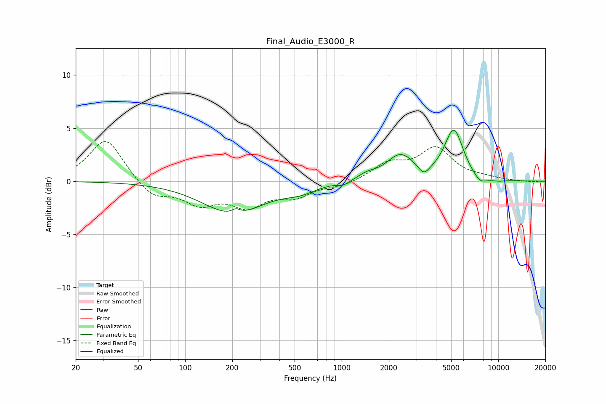

# Final_Audio_E3000_R
See [usage instructions](https://github.com/jaakkopasanen/AutoEq#usage) for more options and info.

### Parametric EQs
Apply preamp of -4.9 dB when using parametric equalizer.

|   # | Type    |   Fc (Hz) |    Q |   Gain (dB) |
|-----|---------|-----------|------|-------------|
|   1 | Peaking |       203 | 0.72 |        -3   |
|   2 | Peaking |       211 | 5.41 |         0.4 |
|   3 | Peaking |       543 | 1.44 |        -0.7 |
|   4 | Peaking |      1026 | 4.11 |        -0.4 |
|   5 | Peaking |      1451 | 2.6  |         0.4 |
|   6 | Peaking |      2371 | 1.57 |         2.4 |
|   7 | Peaking |      3350 | 4.02 |        -0.9 |
|   8 | Peaking |      5202 | 2.33 |         4.7 |
|   9 | Peaking |      7643 | 2.96 |        -0.8 |
|  10 | Peaking |      9976 | 2.49 |        -0.2 |

### Fixed Band EQs
When using fixed band (also called graphic) equalizer, apply preamp of **-3.8 dB** (if available) and set gains manually with these parameters.

|   # | Type    |   Fc (Hz) |    Q |   Gain (dB) |
|-----|---------|-----------|------|-------------|
|   1 | Peaking |        31 | 1.41 |         4.1 |
|   2 | Peaking |        62 | 1.41 |        -1.5 |
|   3 | Peaking |       125 | 1.41 |        -1.9 |
|   4 | Peaking |       250 | 1.41 |        -2.1 |
|   5 | Peaking |       500 | 1.41 |        -1.3 |
|   6 | Peaking |      1000 | 1.41 |        -0.4 |
|   7 | Peaking |      2000 | 1.41 |         1.5 |
|   8 | Peaking |      4000 | 1.41 |         3   |
|   9 | Peaking |      8000 | 1.41 |         0.2 |
|  10 | Peaking |     16000 | 1.41 |        -0.1 |

### Graphs

