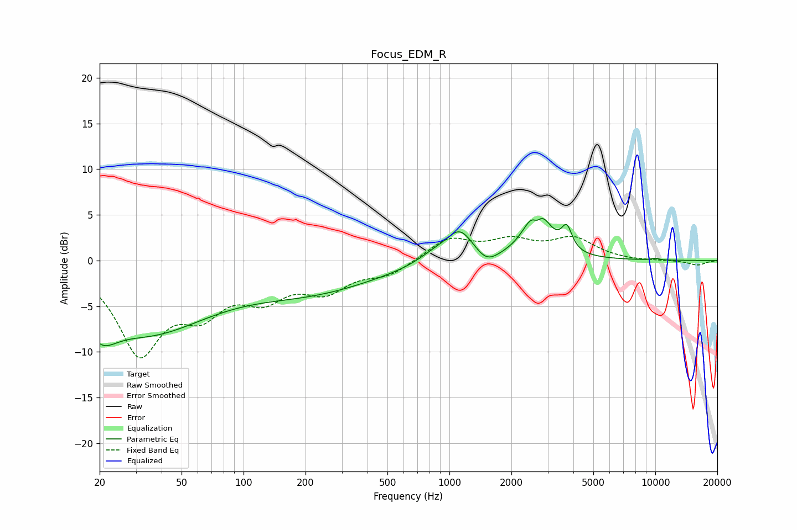

# Focus_EDM_R
See [usage instructions](https://github.com/jaakkopasanen/AutoEq#usage) for more options and info.

### Parametric EQs
Apply preamp of -4.7 dB when using parametric equalizer.

|   # | Type    |   Fc (Hz) |    Q |   Gain (dB) |
|-----|---------|-----------|------|-------------|
|   1 | Peaking |        20 | 1.83 |        -3.3 |
|   2 | Peaking |        34 | 0.46 |        -7.3 |
|   3 | Peaking |       217 | 0.44 |        -3   |
|   4 | Peaking |       846 | 1.67 |         1   |
|   5 | Peaking |      1125 | 2.15 |         3.3 |
|   6 | Peaking |      1518 | 2.64 |        -1.3 |
|   7 | Peaking |      2663 | 5.92 |        -1.9 |
|   8 | Peaking |      2668 | 2.48 |         6.1 |
|   9 | Peaking |      3716 | 5.66 |         2.5 |
|  10 | Peaking |     10000 | 6    |         0.2 |

### Fixed Band EQs
When using fixed band (also called graphic) equalizer, apply preamp of **-2.7 dB** (if available) and set gains manually with these parameters.

|   # | Type    |   Fc (Hz) |    Q |   Gain (dB) |
|-----|---------|-----------|------|-------------|
|   1 | Peaking |        31 | 1.41 |        -9.7 |
|   2 | Peaking |        62 | 1.41 |        -4.4 |
|   3 | Peaking |       125 | 1.41 |        -3.4 |
|   4 | Peaking |       250 | 1.41 |        -2.9 |
|   5 | Peaking |       500 | 1.41 |        -1.5 |
|   6 | Peaking |      1000 | 1.41 |         2.4 |
|   7 | Peaking |      2000 | 1.41 |         1.9 |
|   8 | Peaking |      4000 | 1.41 |         2.3 |
|   9 | Peaking |      8000 | 1.41 |        -0.1 |
|  10 | Peaking |     16000 | 1.41 |        -0.5 |

### Graphs

