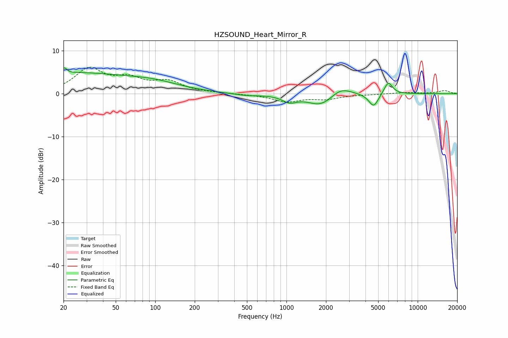

# HZSOUND_Heart_Mirror_R
See [usage instructions](https://github.com/jaakkopasanen/AutoEq#usage) for more options and info.

### Parametric EQs
Apply preamp of -6.1 dB when using parametric equalizer.

|   # | Type    |   Fc (Hz) |    Q |   Gain (dB) |
|-----|---------|-----------|------|-------------|
|   1 | Peaking |        20 | 5.8  |         3.3 |
|   2 | Peaking |        21 | 4.93 |        -2.2 |
|   3 | Peaking |        21 | 0.28 |         4.7 |
|   4 | Peaking |        99 | 0.69 |         1.6 |
|   5 | Peaking |       497 | 1.34 |        -0.5 |
|   6 | Peaking |      1054 | 2.54 |        -1.5 |
|   7 | Peaking |      1841 | 1.4  |        -2.9 |
|   8 | Peaking |      2583 | 1.73 |         2.2 |
|   9 | Peaking |      4618 | 3.77 |        -3.1 |
|  10 | Peaking |      5965 | 4.26 |         2.9 |

### Fixed Band EQs
When using fixed band (also called graphic) equalizer, apply preamp of **-6.2 dB** (if available) and set gains manually with these parameters.

|   # | Type    |   Fc (Hz) |    Q |   Gain (dB) |
|-----|---------|-----------|------|-------------|
|   1 | Peaking |        31 | 1.41 |         5.5 |
|   2 | Peaking |        62 | 1.41 |         2.9 |
|   3 | Peaking |       125 | 1.41 |         2.5 |
|   4 | Peaking |       250 | 1.41 |         0.1 |
|   5 | Peaking |       500 | 1.41 |        -0.1 |
|   6 | Peaking |      1000 | 1.41 |        -1.8 |
|   7 | Peaking |      2000 | 1.41 |        -1.1 |
|   8 | Peaking |      4000 | 1.41 |        -0.1 |
|   9 | Peaking |      8000 | 1.41 |         0.3 |
|  10 | Peaking |     16000 | 1.41 |         0.7 |

### Graphs

