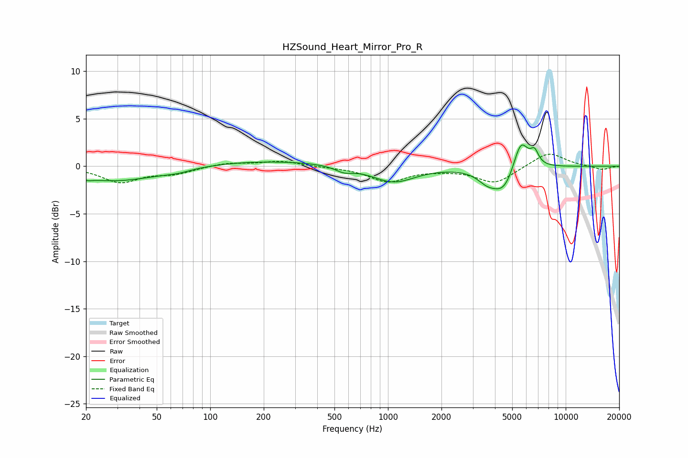

# HZSound_Heart_Mirror_Pro_R
See [usage instructions](https://github.com/jaakkopasanen/AutoEq#usage) for more options and info.

### Parametric EQs
Apply preamp of -2.3 dB when using parametric equalizer.

|   # | Type    |   Fc (Hz) |    Q |   Gain (dB) |
|-----|---------|-----------|------|-------------|
|   1 | Peaking |        20 | 5.74 |        -0.2 |
|   2 | Peaking |        29 | 0.55 |        -1.6 |
|   3 | Peaking |        66 | 1.76 |        -0.3 |
|   4 | Peaking |       200 | 0.33 |         0.6 |
|   5 | Peaking |       566 | 2.81 |        -0.6 |
|   6 | Peaking |      1072 | 1.16 |        -1.7 |
|   7 | Peaking |      3619 | 2.5  |        -1.1 |
|   8 | Peaking |      4495 | 2.19 |        -2.5 |
|   9 | Peaking |      5585 | 3.29 |         3.3 |
|  10 | Peaking |      6679 | 6    |         1.4 |

### Fixed Band EQs
When using fixed band (also called graphic) equalizer, apply preamp of **-1.4 dB** (if available) and set gains manually with these parameters.

|   # | Type    |   Fc (Hz) |    Q |   Gain (dB) |
|-----|---------|-----------|------|-------------|
|   1 | Peaking |        31 | 1.41 |        -1.6 |
|   2 | Peaking |        62 | 1.41 |        -0.7 |
|   3 | Peaking |       125 | 1.41 |         0.4 |
|   4 | Peaking |       250 | 1.41 |         0.5 |
|   5 | Peaking |       500 | 1.41 |        -0.1 |
|   6 | Peaking |      1000 | 1.41 |        -1.6 |
|   7 | Peaking |      2000 | 1.41 |        -0.2 |
|   8 | Peaking |      4000 | 1.41 |        -1.8 |
|   9 | Peaking |      8000 | 1.41 |         1.5 |
|  10 | Peaking |     16000 | 1.41 |        -0.4 |

### Graphs

