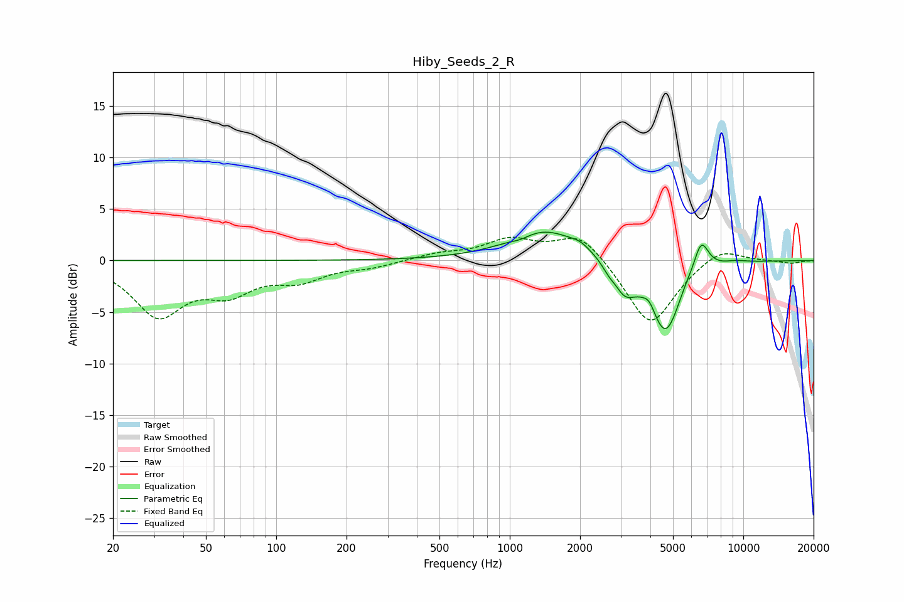

# Hiby_Seeds_2_R
See [usage instructions](https://github.com/jaakkopasanen/AutoEq#usage) for more options and info.

### Parametric EQs
Apply preamp of -2.8 dB when using parametric equalizer.

|   # | Type    |   Fc (Hz) |    Q |   Gain (dB) |
|-----|---------|-----------|------|-------------|
|   1 | Peaking |      1116 | 3.52 |        -0.3 |
|   2 | Peaking |      1413 | 0.94 |         3   |
|   3 | Peaking |      2011 | 3.3  |         0.5 |
|   4 | Peaking |      2641 | 5.62 |        -0.5 |
|   5 | Peaking |      3105 | 2.93 |        -2.6 |
|   6 | Peaking |      3964 | 6    |         0.8 |
|   7 | Peaking |      4642 | 2.1  |        -7.1 |
|   8 | Peaking |      5595 | 4.97 |         0.4 |
|   9 | Peaking |      6598 | 4.2  |         3.2 |
|  10 | Peaking |      9223 | 2.43 |         0.2 |

### Fixed Band EQs
When using fixed band (also called graphic) equalizer, apply preamp of **-2.3 dB** (if available) and set gains manually with these parameters.

|   # | Type    |   Fc (Hz) |    Q |   Gain (dB) |
|-----|---------|-----------|------|-------------|
|   1 | Peaking |        31 | 1.41 |        -5.1 |
|   2 | Peaking |        62 | 1.41 |        -2.6 |
|   3 | Peaking |       125 | 1.41 |        -1.7 |
|   4 | Peaking |       250 | 1.41 |        -0.6 |
|   5 | Peaking |       500 | 1.41 |         0.6 |
|   6 | Peaking |      1000 | 1.41 |         1.9 |
|   7 | Peaking |      2000 | 1.41 |         2.8 |
|   8 | Peaking |      4000 | 1.41 |        -6.5 |
|   9 | Peaking |      8000 | 1.41 |         1.5 |
|  10 | Peaking |     16000 | 1.41 |        -0.3 |

### Graphs

