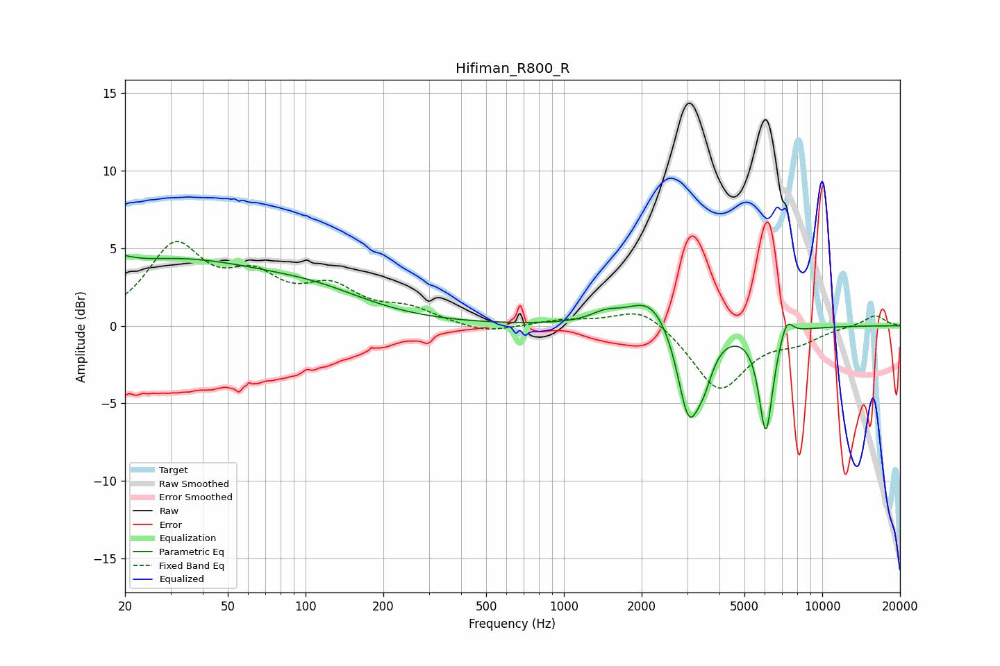

# Hifiman_R800_R
See [usage instructions](https://github.com/jaakkopasanen/AutoEq#usage) for more options and info.

### Parametric EQs
Apply preamp of -4.6 dB when using parametric equalizer.

|   # | Type    |   Fc (Hz) |    Q |   Gain (dB) |
|-----|---------|-----------|------|-------------|
|   1 | Peaking |        20 | 5.4  |         3   |
|   2 | Peaking |        20 | 5.85 |        -2.4 |
|   3 | Peaking |        29 | 0.33 |         4.2 |
|   4 | Peaking |       114 | 0.7  |         1   |
|   5 | Peaking |      1450 | 2.44 |         0.6 |
|   6 | Peaking |      2181 | 1.64 |         2.1 |
|   7 | Peaking |      3042 | 3.21 |        -5.9 |
|   8 | Peaking |      3498 | 4.12 |        -1.7 |
|   9 | Peaking |      6052 | 5.1  |        -6.7 |
|  10 | Peaking |      7279 | 5.51 |         1.3 |

### Fixed Band EQs
When using fixed band (also called graphic) equalizer, apply preamp of **-5.5 dB** (if available) and set gains manually with these parameters.

|   # | Type    |   Fc (Hz) |    Q |   Gain (dB) |
|-----|---------|-----------|------|-------------|
|   1 | Peaking |        31 | 1.41 |         4.9 |
|   2 | Peaking |        62 | 1.41 |         2.5 |
|   3 | Peaking |       125 | 1.41 |         2.1 |
|   4 | Peaking |       250 | 1.41 |         0.9 |
|   5 | Peaking |       500 | 1.41 |        -0.5 |
|   6 | Peaking |      1000 | 1.41 |         0.4 |
|   7 | Peaking |      2000 | 1.41 |         1.4 |
|   8 | Peaking |      4000 | 1.41 |        -4.1 |
|   9 | Peaking |      8000 | 1.41 |        -0.8 |
|  10 | Peaking |     16000 | 1.41 |         0.7 |

### Graphs

