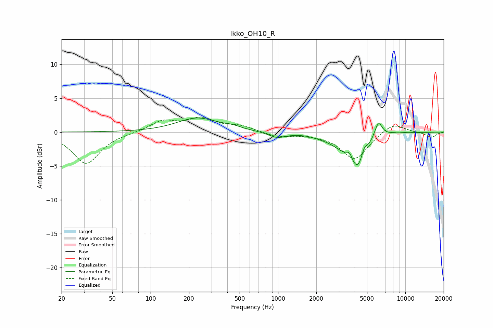

# Ikko_OH10_R
See [usage instructions](https://github.com/jaakkopasanen/AutoEq#usage) for more options and info.

### Parametric EQs
Apply preamp of -2.2 dB when using parametric equalizer.

|   # | Type    |   Fc (Hz) |    Q |   Gain (dB) |
|-----|---------|-----------|------|-------------|
|   1 | Peaking |       233 | 0.89 |         2.1 |
|   2 | Peaking |       439 | 2.1  |         0.4 |
|   3 | Peaking |       987 | 2.15 |        -0.8 |
|   4 | Peaking |      2178 | 1.97 |        -0.3 |
|   5 | Peaking |      3134 | 1.57 |        -1.2 |
|   6 | Peaking |      3647 | 6    |         1.1 |
|   7 | Peaking |      4238 | 2.1  |        -5   |
|   8 | Peaking |      4748 | 6    |         1.5 |
|   9 | Peaking |      6140 | 4.35 |         2.5 |
|  10 | Peaking |      8637 | 2.83 |         0.2 |

### Fixed Band EQs
When using fixed band (also called graphic) equalizer, apply preamp of **-2.3 dB** (if available) and set gains manually with these parameters.

|   # | Type    |   Fc (Hz) |    Q |   Gain (dB) |
|-----|---------|-----------|------|-------------|
|   1 | Peaking |        31 | 1.41 |        -4.7 |
|   2 | Peaking |        62 | 1.41 |        -0.1 |
|   3 | Peaking |       125 | 1.41 |         1.6 |
|   4 | Peaking |       250 | 1.41 |         1.9 |
|   5 | Peaking |       500 | 1.41 |         0.8 |
|   6 | Peaking |      1000 | 1.41 |        -0.7 |
|   7 | Peaking |      2000 | 1.41 |        -0.2 |
|   8 | Peaking |      4000 | 1.41 |        -4   |
|   9 | Peaking |      8000 | 1.41 |         1.5 |
|  10 | Peaking |     16000 | 1.41 |        -0.8 |

### Graphs

