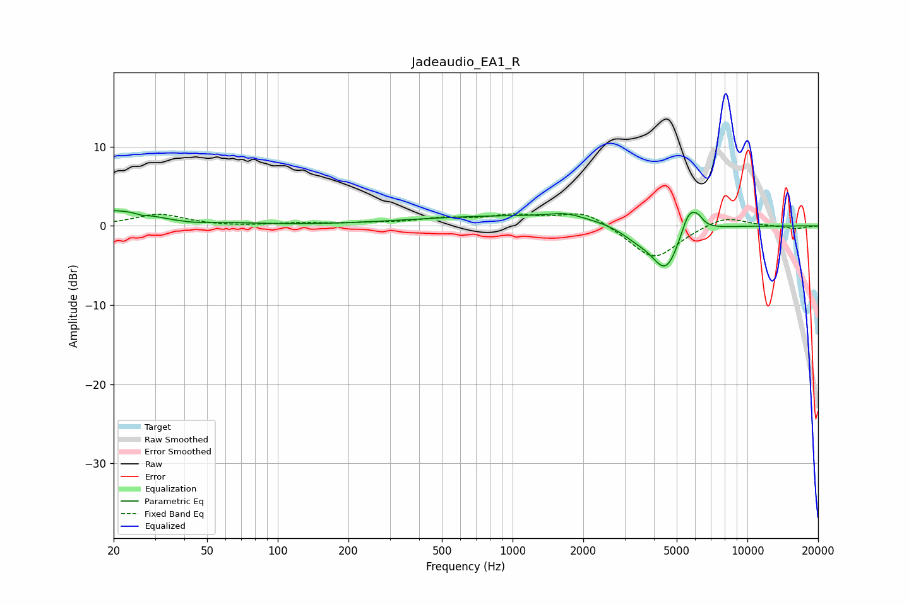

# Jadeaudio_EA1_R
See [usage instructions](https://github.com/jaakkopasanen/AutoEq#usage) for more options and info.

### Parametric EQs
Apply preamp of -2.0 dB when using parametric equalizer.

|   # | Type    |   Fc (Hz) |    Q |   Gain (dB) |
|-----|---------|-----------|------|-------------|
|   1 | Peaking |        20 | 0.6  |         2   |
|   2 | Peaking |        26 | 5.3  |        -0.3 |
|   3 | Peaking |        35 | 1.87 |        -0.4 |
|   4 | Peaking |        44 | 2.28 |        -0.3 |
|   5 | Peaking |      1097 | 0.3  |         1.3 |
|   6 | Peaking |      1685 | 2.01 |         0.6 |
|   7 | Peaking |      3374 | 1.92 |        -1.3 |
|   8 | Peaking |      4498 | 2.25 |        -5.8 |
|   9 | Peaking |      5628 | 3.99 |         3.4 |
|  10 | Peaking |      6164 | 6    |         1   |

### Fixed Band EQs
When using fixed band (also called graphic) equalizer, apply preamp of **-1.6 dB** (if available) and set gains manually with these parameters.

|   # | Type    |   Fc (Hz) |    Q |   Gain (dB) |
|-----|---------|-----------|------|-------------|
|   1 | Peaking |        31 | 1.41 |         1.5 |
|   2 | Peaking |        62 | 1.41 |        -0.1 |
|   3 | Peaking |       125 | 1.41 |         0.3 |
|   4 | Peaking |       250 | 1.41 |         0.3 |
|   5 | Peaking |       500 | 1.41 |         0.8 |
|   6 | Peaking |      1000 | 1.41 |         1.1 |
|   7 | Peaking |      2000 | 1.41 |         1.9 |
|   8 | Peaking |      4000 | 1.41 |        -4.3 |
|   9 | Peaking |      8000 | 1.41 |         1.4 |
|  10 | Peaking |     16000 | 1.41 |        -0.4 |

### Graphs

